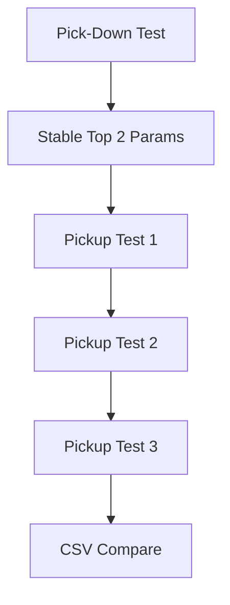
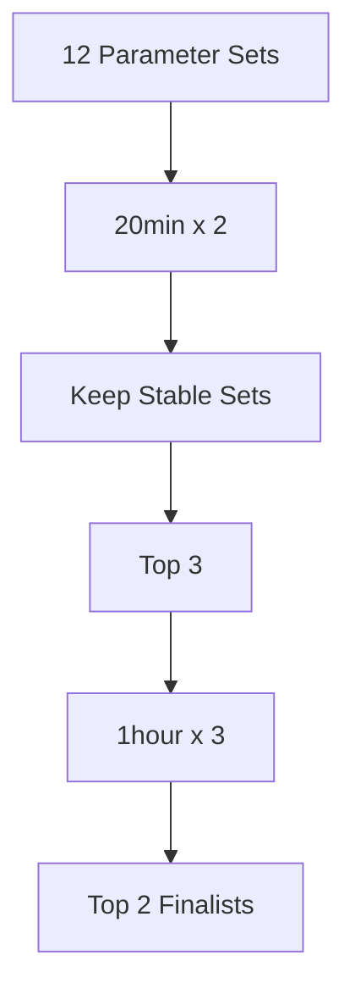
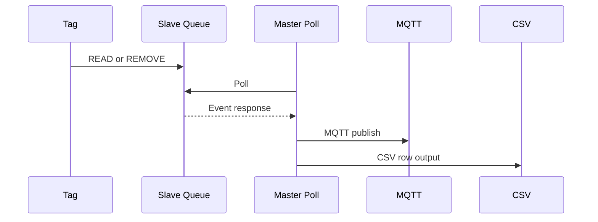

# ESP-NOW NFC Test Plan

## Goal

픽다운 안정성을 최우선으로 검증하고, 그 결과로 파라미터 후보 2개를 선정한 뒤 같은 후보 2개로 픽업 테스트 1, 2, 3을 연속 수행한다.  
모든 결과는 마스터 기준 시각으로 CSV에 자동 기록한다.



## Fixed Test Order

### 1. Pick-Down First

- 목적: 태그가 계속 붙어 있을 때 `REMOVE` 오검출이 발생하지 않는지 확인
- 구조: `Master 1 : Slave 4`
- 마스터 동작: `Slave-1 -> Slave-2 -> Slave-3 -> Slave-4` 순차 polling
- 태그 4개를 모두 자석으로 고정

### 2. Candidate Reduction

- 1차 후보
  - `pollIntervalMs`: `5`, `25`, `50`
  - 설명: `5ms`는 유선 I2C처럼 슬레이브 간 거의 연속 요청에 가까운 시작값
  - `removeTimeMs`: `100`, `300`, `500`, `700`
- 스크리닝: 각 조합 `20분 x 2회`
- 본검증: 상위 3개 조합 `1시간 x 3회`
- 최종 선정: 상위 `2개`



## Pick-Down Test Spec

### Pass Rule

- 이상적 기준: `REMOVE 0회`
- 탈락 기준: `1시간 기준 REMOVE 1회 이상`

### Key Metrics

- `REMOVE` 발생 횟수
- `REMOVE -> READ` 재발생 횟수
- Slave별 편차

## Pickup Test Spec

픽다운 종료 후 선정된 후보 2개 각각에 대해 아래 3개 테스트를 연속 수행한다.

### Pickup Test 1: Sequential Baseline

- Slave-1만 `30회`
- Slave-2만 `30회`
- Slave-3만 `30회`
- Slave-4만 `30회`

### Pickup Test 2: Simultaneous Pickup

- `1&4 동시` `30회`
- `1&2 동시` `30회`
- `1&2&3&4 동시` `30회`

### Pickup Test 3: Interference Stress

- 250Mbps 간섭 환경
- `1&4 동시` `30회`
- `1&2&3&4 동시` `30회`



## CSV Schema

Path:

`C:\WS\vs_kdh\pnk_kdh\espnow\esp_now_test_data.csv`

Columns:

- `Test_ID`
- `Slave_ID`
- `NFC_Index`
- `Event`
- `T1_Poll`
- `T2_Recv`
- `T3_MQTT`
- `Latency_Radio`
- `Latency_Wifi`
- `Total_Latency`
- `Status`

## Time Definition

- `T1_Poll`: 마스터가 해당 슬레이브에 poll 보낸 시각
- `T2_Recv`: 마스터가 이벤트를 수신한 시각
- `T3_MQTT`: 마스터가 MQTT publish 호출을 마친 시각

주의:

- 현재 `T3_MQTT`는 브로커 QoS ACK 시점이 아니라 `publish()` 반환 시점이다.

## CSV Output Rule

```text
CSV,Test_ID,Slave_ID,NFC_Index,Event,T1_Poll,T2_Recv,T3_MQTT,Latency_Radio,Latency_Wifi,Total_Latency,Status
```

Python 수집 스크립트는 `CSV,`로 시작하는 줄만 추출해 파일 끝에 append 한다.
