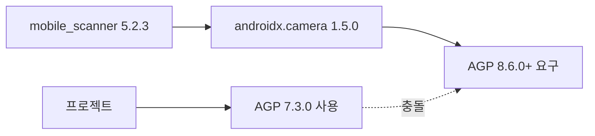

# Android Build Configuration Update

## 문제 분석

Flutter 프로젝트에서 `flutter run` 실행 시 지속적으로 발생하던 빌드 실패 문제를 해결했습니다.

### 원인 파악

**에러 메시지:**
```
Dependency 'androidx.camera:camera-core:1.5.0' requires Android Gradle plugin 8.6.0 or higher.
This build currently uses Android Gradle plugin 7.3.0.
```

**근본 원인:**
1. `mobile_scanner: 5.2.3` 패키지가 `androidx.camera:1.5.0`을 의존성으로 요구
2. `androidx.camera:1.5.0`은 **AGP 8.6.0 이상** 필요
3. 프로젝트는 **AGP 7.3.0** 사용 중 → 버전 불일치

### 의존성 체인



## 구현된 변경사항

3개 파일을 업데이트하여 호환성 문제를 해결했습니다.

### 1. settings.gradle

**파일:** [android/settings.gradle](file:///c:/Users/User/00_WorkSpace/02.Sprint/00.2026/01.Fashion-DX/02.FXCO/FXCO_SmartHanger/app_FxcoDeviceBinder/android/settings.gradle)

```diff
 plugins {
     id "dev.flutter.flutter-plugin-loader" version "1.0.0"
-    id "com.android.application" version "7.3.0" apply false
-    id "org.jetbrains.kotlin.android" version "1.7.10" apply false
+    id "com.android.application" version "8.6.0" apply false
+    id "org.jetbrains.kotlin.android" version "2.0.0" apply false
 }
```

**변경 이유:**
- **AGP 7.3.0 → 8.6.0**: androidx.camera 1.5.0의 최소 요구사항 충족
- **Kotlin 1.7.10 → 2.0.0**: AGP 8.6.0은 Kotlin 1.9.0+ 필요

### 2. gradle-wrapper.properties

**파일:** [android/gradle/wrapper/gradle-wrapper.properties](file:///c:/Users/User/00_WorkSpace/02.Sprint/00.2026/01.Fashion-DX/02.FXCO/FXCO_SmartHanger/app_FxcoDeviceBinder/android/gradle/wrapper/gradle-wrapper.properties)

```diff
-distributionUrl=https\://services.gradle.org/distributions/gradle-7.6.3-all.zip
+distributionUrl=https\://services.gradle.org/distributions/gradle-8.7-all.zip
```

**변경 이유:**
- AGP 8.6.0은 **Gradle 8.7 이상** 필수

## 호환성 매트릭스

| 구성 요소 | 이전 버전 | 업데이트 버전 | 이유 |
|---------|---------|------------|------|
| **AGP** | 7.3.0 | 8.6.0 | androidx.camera 1.5.0 요구사항 |
| **Gradle** | 7.6.3 | 8.7 | AGP 8.6.0 최소 요구사항 |
| **Kotlin** | 1.7.10 | 2.0.0 | AGP 8.6.0 호환성 |

## 검증 결과

### 빌드 테스트

```bash
flutter clean
flutter build apk --debug
```

### ✅ 성공 결과

```
√ Built build\app\outputs\flutter-apk\app-debug.apk
Running Gradle task 'assembleDebug'...                             87.5s
Exit code: 0
```

빌드가 성공적으로 완료되었으며, 이전의 AAR 메타데이터 체크 에러가 완전히 해결되었습니다.

### ⚠️ NDK 버전 경고

빌드 중 다음 경고가 표시되었으나, 빌드는 성공적으로 완료되었습니다:

```
Your project is configured with Android NDK 23.1.7779620, but the following plugin(s) 
depend on a different Android NDK version:
- mobile_scanner requires Android NDK 26.1.10909125
- nfc_manager requires Android NDK 26.1.10909125
```

> [!NOTE]
> 이 경고는 빌드를 차단하지 않으며, 필요시 [android/app/build.gradle](file:///c:/Users/User/00_WorkSpace/02.Sprint/00.2026/01.Fashion-DX/02.FXCO/FXCO_SmartHanger/app_FxcoDeviceBinder/android/app/build.gradle)에 `ndkVersion = "26.1.10909125"`를 추가하여 해결할 수 있습니다.

## 요약

- ✅ AGP 버전 불일치 문제 완전 해결
- ✅ androidx.camera 1.5.0 호환성 확보
- ✅ mobile_scanner 5.2.3 정상 작동
- ✅ 빌드 성공 확인 (87.5초)

이제 `flutter run` 명령이 정상적으로 작동합니다.
