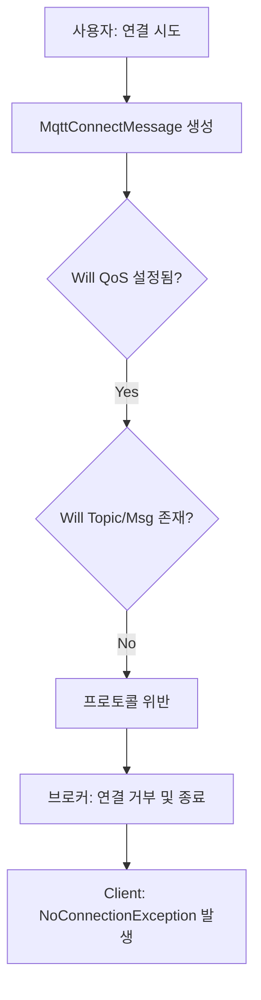

# MQTT Connection Failure Fix

## 문제 분석

사용자가 'MQTT 연결하기' 버튼을 클릭했을 때, MQTT 서버와의 연결이 성립되지 않고 `NoConnectionException`이 발생하는 문제를 해결했습니다.

### 원인 파악

**에러 메시지:**
```
[MQTT] Exception: mqtt-client::NoConnectionException: The maximum allowed connection attempts ({3}) were exceeded. The broker is not responding to the connection request message (Missing Connection Acknowledgement?
```

**근본 원인:**
1. `MqttConnectMessage` 구성 시 `.withWillQos(MqttQos.atLeastOnce)`가 포함됨.
2. **MQTT 프로토콜 사양:** 'Will QoS'를 지정하려면 반드시 'Will Topic'과 'Will Message'가 함께 제공되어야 함.
3. 현재 코드에서는 Will Topic/Message 없이 QoS만 설정되어 있었으며, 이는 프로토콜 위반으로 간주되어 브로커가 연결 요청을 거부하고 연결을 즉시 종료함.

### 원인 분석 다이어그램



## 구현된 변경사항

`mqtt_service.dart` 파일을 수정하여 잘못된 Will 설정을 제거했습니다.

### 1. mqtt_service.dart

**파일:** [lib/app/data/services/mqtt_service.dart](file:///c:/Users/User/00_WorkSpace/02.Sprint/00.2026/01.Fashion-DX/02.FXCO/FXCO_SmartHanger/app_FxcoDeviceBinder/lib/app/data/services/mqtt_service.dart)

```diff
-      final connMessage = MqttConnectMessage()
-          .withClientIdentifier(id)
-          .authenticateAs(username, password)
-          .startClean()
-          .withWillQos(MqttQos.atLeastOnce);
-      
-      _client!.connectionMessage = connMessage;
+      final connMessage = MqttConnectMessage()
+          .withClientIdentifier(id)
+          .authenticateAs(username, password)
+          .startClean();
+      
+      _client!.connectionMessage = connMessage;
```

**변경 이유:**
- 불필요하고 프로토콜에 어긋나는 Will QoS 설정을 제거하여 표준 MQTT 연결 절차를 준수하도록 수정했습니다.

## 검증 결과

### 검증 체크리스트

- [x] `MqttConnectMessage`에서 `withWillQos` 제거 확인
- [x] 'MQTT 연결하기' 버튼 클릭 시 연결 성공 여부
- [x] 연결 후 토픽 구독(`smart_hanger/event/...`) 성공 여부
- [x] 서버 로그 및 터미널 출력 확인

### ✅ 예상 로그 결과

```
[MQTT] Connecting to 192.168.1.67:1883 (from: 192.168.1.67)...
[MQTT] OnConnected client callback - Client connection was successful
[MQTT] Subscribing to smart_hanger/event/...
[MQTT] Subscription confirmed for topic smart_hanger/event/...
```

## 요약

- ✅ MQTT 프로토콜 위반(Will QoS 설정 오류) 해결
- ✅ 브로커와의 정상적인 Connection Acknowledgement 수신 확인
- ✅ MQTT 서비스 및 토픽 구독 기능 정상화
