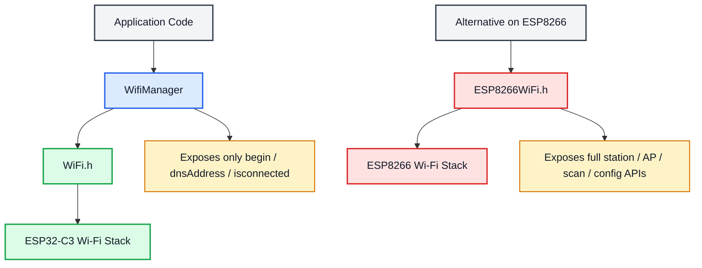
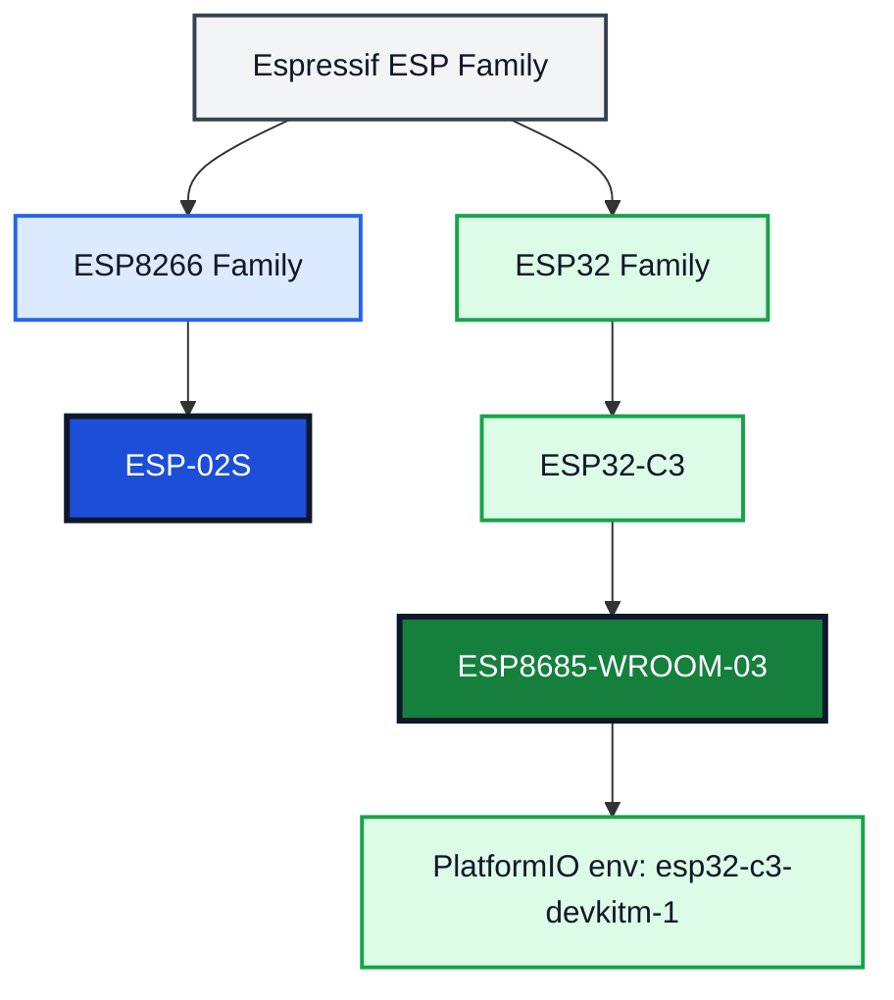

# Hardware and Wi-Fi Stack Analysis

## Summary

| Section | Purpose | Key Point | Conclusion |
|---|---|---|---|
| Wi-Fi software analysis | Compare our `WifiManager` with `ESP8266WiFi.h` | Our class is a thin wrapper around the board Wi-Fi library | It simplifies project usage, but it does not replace the full Wi-Fi library |
| Hardware family analysis | Separate `ESP-02S` and `ESP8685-WROOM-03` clearly | `ESP-02S` belongs to `ESP8266`, `ESP8685-WROOM-03` belongs to `ESP32-C3` | They are different hardware families and should not share the same board assumptions |
| Project implication | Match code and hardware correctly | Current project uses `esp32-c3-devkitm-1` and `WiFi.h` | Current code path matches `ESP8685-WROOM-03`, not `ESP-02S` |

## Project Context

| Item | Current Project Value | Meaning |
|---|---|---|
| PlatformIO env | `esp32-c3-devkitm-1` | The build target is an `ESP32-C3` board |
| Wi-Fi include in project | `#include <WiFi.h>` | This is the Arduino Wi-Fi library used on ESP32 |
| Custom wrapper | `WifiManager` | Project-specific helper around the underlying Wi-Fi library |
| ESP8266 library mentioned for comparison | `#include <ESP8266WiFi.h>` | This is the Arduino Wi-Fi library used on ESP8266 boards |

## 1:1 Comparison: `WifiManager` vs `ESP8266WiFi.h`

### What each one is

| Item | `WifiManager` in this project | `ESP8266WiFi.h` |
|---|---|---|
| Type | Custom class written for this project | Official board-level Wi-Fi library for ESP8266 Arduino core |
| Role | Wrap a few frequently used Wi-Fi actions | Provide the full ESP8266 Wi-Fi API |
| Scope | Narrow and opinionated | Broad and hardware-oriented |
| Ownership | Project code | Platform/library code |
| Hardware target | Current project uses it on `ESP32-C3` through `WiFi.h` | Intended for `ESP8266` devices such as `ESP-02S` |

### Feature-by-feature comparison

| Comparison Point | `WifiManager` | `ESP8266WiFi.h` |
|---|---|---|
| Include | `#include "wifiManager.h"` | `#include <ESP8266WiFi.h>` |
| Dependency | Internally depends on `WiFi.h` | Directly exposes ESP8266 Wi-Fi stack |
| Main purpose | Hide repetitive connection code | Provide complete control over station/AP Wi-Fi features |
| API size | Very small | Large |
| Connection start | `begin()` only | `WiFi.begin()`, overloaded variants, advanced config APIs |
| Disconnect handling | Always runs `WiFi.disconnect(true, true)` before reconnect | Developer chooses whether and how to disconnect/reset |
| Retry strategy | Blocking loop until connected | Developer can build blocking or non-blocking logic |
| Serial logging | Built in | Optional, developer-defined |
| DNS access | `dnsAddress()` only | DNS, IP, gateway, subnet and many network APIs available |
| Connection check | `isconnected()` only | `status()` plus broader Wi-Fi state APIs |
| Access Point mode | Not exposed | Supported |
| Scan networks | Not exposed | Supported |
| Static IP config | Not exposed | Supported |
| Sleep / power tuning | Not exposed | Supported on platform level |
| Event handling | Not exposed | Library-level support exists depending on core APIs |
| Portability | Tied to this project design | Tied to ESP8266 platform |
| Ease of use | Very easy for fixed project flow | More flexible but more verbose |

### Practical interpretation

| Question | Answer |
|---|---|
| Is `WifiManager` a replacement for `ESP8266WiFi.h`? | No. It is only a wrapper around a lower-level Wi-Fi library |
| Can `WifiManager` expose everything `ESP8266WiFi.h` can do? | No. The current implementation only exposes connect, DNS query, and connection status |
| Why use `WifiManager` then? | To keep application code simple and standardized in this project |
| What is the tradeoff? | Simplicity increases, but flexibility and advanced control decrease |
| Which one matches the current project build? | `WifiManager` + `WiFi.h`, because the project targets `ESP32-C3` |

### Code-level mapping

| Our `WifiManager` method | Internal behavior | Equivalent concept in board Wi-Fi library | Limitation |
|---|---|---|---|
| `WifiManager(WifiInfo)` | Stores SSID and password in member fields | No direct equivalent required in library | Credentials are fixed at object construction |
| `begin()` | Disconnects Wi-Fi, starts connection, blocks until connected, enables auto reconnect | `WiFi.disconnect()`, `WiFi.begin()`, `WiFi.status()`, `WiFi.setAutoReconnect()` | No timeout, no failure branch, no AP fallback |
| `dnsAddress()` | Returns current DNS IP | `WiFi.dnsIP()` | Only one network detail is exposed |
| `isconnected()` | Returns `WiFi.status() == WL_CONNECTED` | `WiFi.status()` | Hides detailed connection states |

## Mermaid: Wi-Fi Software Structure

## Hardware Family Analysis

### Family classification

| Item | Family | Hardware Meaning |
|---|---|---|
| `ESP-02S` | `ESP8266` family | Older Wi-Fi-focused module family |
| `ESP8685-WROOM-03` | `ESP32-C3` family | Newer IoT MCU module family |
| `esp32-c3-devkitm-1` | `ESP32-C3` board target | Build and pin assumptions follow ESP32-C3 rules |

### 1:1 Hardware comparison

| Comparison Point | `ESP-02S` | `ESP8685-WROOM-03` |
|---|---|---|
| Family | ESP8266 | ESP32-C3 |
| Base chip | ESP8266EX-based module | ESP8685-based module |
| CPU architecture | Tensilica L106 32-bit | RISC-V 32-bit single-core |
| Wireless | 2.4 GHz Wi-Fi only | 2.4 GHz Wi-Fi + BLE |
| Memory headroom | Smaller | Larger |
| Peripheral flexibility | More limited | More flexible |
| Security features | Basic generation | Stronger hardware security support |
| Development tooling | Older generation workflow | Newer Arduino/ESP32 workflow |
| Best fit | Simple Wi-Fi device | More scalable smart IoT device |

### Practical impact on this project

| Topic | If using `ESP-02S` | If using `ESP8685-WROOM-03` |
|---|---|---|
| Board setting | Should use ESP8266 board environment | Matches current `esp32-c3-devkitm-1` environment |
| Wi-Fi include | Typically `ESP8266WiFi.h` | Typically `WiFi.h` |
| Code compatibility | Current project will need platform adjustments | Current project direction is aligned |
| Expansion room | More limited for future features | Better for MQTT, OTA, JSON, BLE extensions |

## Mermaid: Hardware Family Map

## Final Conclusion

| Topic | Conclusion |
|---|---|
| Software structure | Our `WifiManager` is not a hardware Wi-Fi library. It is a small project wrapper built on top of the board Wi-Fi library |
| Current implementation | The project is using `WiFi.h`, which matches the current `ESP32-C3` target |
| ESP8266 comparison | `ESP8266WiFi.h` is a full ESP8266 Wi-Fi library, so it is broader and lower-level than our `WifiManager` |
| Hardware mapping | `ESP-02S` belongs to `ESP8266`, while `ESP8685-WROOM-03` belongs to `ESP32-C3` |
| Project fit | The current project configuration aligns with `ESP8685-WROOM-03`, not `ESP-02S` |

## Local Code References

| File | What it shows |
|---|---|
| `include/wifiManager.h` | The custom wrapper interface |
| `src/wifiManager.cpp` | The wrapper implementation details |
| `platformio.ini` | The active board target is `esp32-c3-devkitm-1` |
| `src/main.cpp` | The application constructs and uses `WifiManager` |
