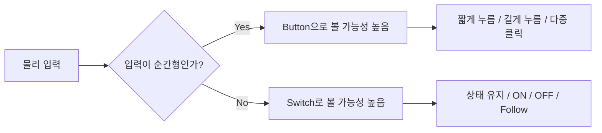
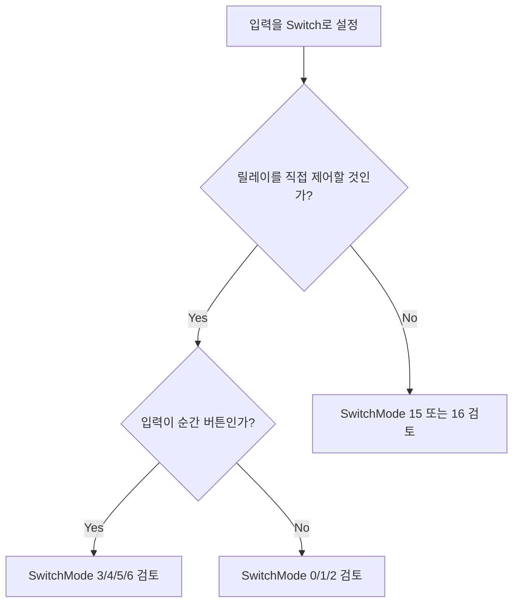
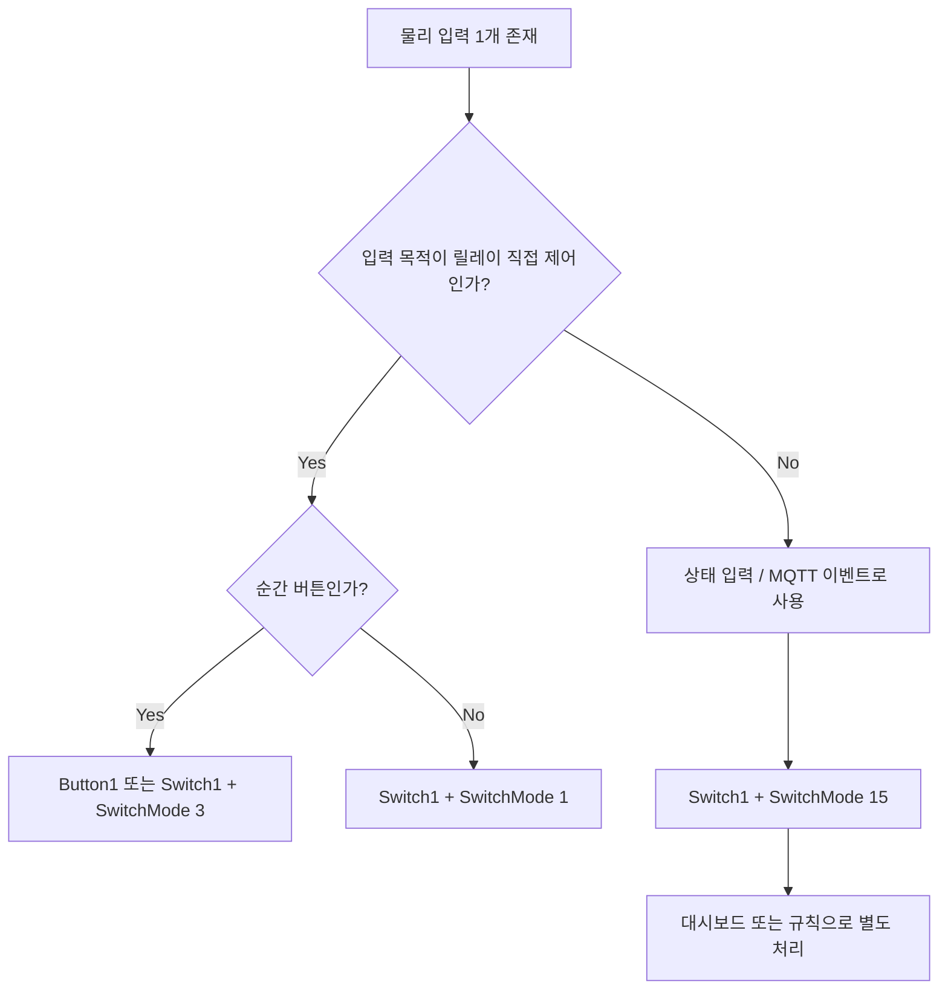

# Tasmota Buttons and Switches Summary

## 문서 목적

이 문서는 Tasmota 공식 문서의 `Buttons and Switches` 내용을 스마트 플러그 관점에서 다시 정리한 문서다.

핵심 목적은 아래 3가지다.

1. `Button`과 `Switch`의 차이를 이해하기
2. GPIO 설정과 `SwitchMode`를 어떤 기준으로 선택할지 정리하기
3. 우리 스마트 플러그에서 어떤 방식으로 적용하면 될지 빠르게 판단하기

---

## 한눈에 보는 핵심 정리

| 항목 | 핵심 내용 |
|---|---|
| Button | 보통 순간 입력용 푸시 버튼. 한 번 누름, 다중 클릭, 길게 누름 같은 동작 처리에 적합 |
| Switch | 상태를 유지하는 토글 스위치 또는 상태 기반 입력. 버튼도 Switch처럼 쓸 수는 있지만 의미가 다름 |
| 가장 중요한 차이 | Tasmota는 하드웨어 생김새보다 "어떻게 동작시키고 싶은지" 기준으로 Button/Switch를 나눠 생각함 |
| 스마트 플러그 관점 | 물리 버튼 하나로 릴레이 ON/OFF를 단순 제어하려면 `Button` 또는 `Switch + SwitchMode` 중 의도에 맞게 선택해야 함 |

---

## Button vs Switch

### 개념 차이

| 구분 | Button | Switch |
|---|---|---|
| 물리적 의미 | 누르고 있는 동안만 동작하는 순간 입력 | 한 번 바꾸면 상태가 유지되는 입력 |
| 대표 예시 | 푸시 버튼, 터치 버튼 | 토글 스위치, 리드 스위치, PIR 상태 입력 |
| Tasmota 기본 성격 | 멀티프레스, HOLD, 규칙 트리거에 유리 | 상태 변화에 따라 ON/OFF 또는 TOGGLE 처리에 유리 |
| 기본 동작 | 해당 `Power` 상태를 토글 | 기본적으로 해당 `Power` 상태를 제어 |

### 직관적인 이해



---

## GPIO 구성 선택 기준

Tasmota에서는 회로 구성이 다르면 같은 버튼이라도 다른 GPIO 옵션을 선택해야 한다.

### 기본 변형

| 타입 | 의미 |
|---|---|
| `Button` | 액티브 로우, 내부 풀업 사용 |
| `Button_n` | 액티브 로우, 내부 풀업 없음 |
| `Button_i` | 반전형, 액티브 하이, 내부 풀업 사용 |
| `Button_in` | 반전형, 액티브 하이, 내부 풀업 없음 |
| `Switch` | 내부 풀업 있는 스위치 |
| `Switch_n` | 풀업 없는 스위치 |
| `Button_d` | 내부 풀다운 저항 있는 버튼, ESP32 계열 지원 |
| `Button_id` | 반전 버튼 + 내부 풀다운, ESP32 계열 지원 |
| `Switch_d` | 내부 풀다운 스위치, ESP32 계열 지원 |

### GPIO 선택 판단 기준

| 질문 | 확인해야 할 것 |
|---|---|
| 버튼/스위치가 눌릴 때 GPIO가 GND로 떨어지는가 | 액티브 로우 여부 |
| 버튼/스위치가 눌릴 때 GPIO가 VCC 쪽으로 올라가는가 | 액티브 하이 여부 |
| 보드에 외부 풀업/풀다운이 있는가 | `_n`, `_d`, `_i`, `_in` 선택 기준 |
| 현재 사용하는 칩이 ESP32 계열인가 | `Button_d`, `Switch_d` 사용 가능 여부 |

---

## SwitchMode 요약

`SwitchMode`는 GPIO가 `Switch<x>`로 설정된 경우에만 적용된다.

즉, 같은 물리 버튼이라도 `Switch`로 구성하면 `SwitchMode`로 동작을 세밀하게 바꿀 수 있다.

### 많이 쓰는 SwitchMode만 추려서 정리

| SwitchMode | 의미 | 추천 상황 |
|---:|---|---|
| `0` | 상태 바뀔 때마다 `TOGGLE` | 토글 스위치, 단순 ON/OFF 뒤집기 |
| `1` | Follow 모드, `0=OFF`, `1=ON` | 실제 스위치 상태와 화면 상태를 맞추고 싶을 때 |
| `2` | Inverted Follow, `0=ON`, `1=OFF` | 회로가 반전된 경우 |
| `3` | 푸시 버튼 모드, 누를 때만 동작 | 순간 버튼을 `Switch`처럼 쓸 때 |
| `4` | 반전 푸시 버튼 모드 | 반전 회로의 순간 버튼 |
| `5` | 길게 누름 포함 푸시 버튼 | HOLD를 규칙에 쓰고 싶을 때 |
| `6` | 반전 + 길게 누름 | 반전 회로 + HOLD 필요 |
| `11` | 디밍 + 더블 누름 포함 푸시 버튼 | 조명/디머류에 유용 |
| `13` | 누르면 ON | 펄스성 입력, PIR 느낌의 동작 |
| `14` | 반전 누르면 ON | 반전 회로 PIR류 입력 |
| `15` | 전원 제어 안 하고 MQTT 상태만 송신 | 릴레이와 입력을 분리하고 싶을 때 |
| `16` | 반전 MQTT 상태만 송신 | 반전 입력 + MQTT 전송 전용 |

### SwitchMode 선택 흐름



---

## 스마트 플러그 관점에서 가장 중요한 포인트

### 1. 기본 동작을 그대로 쓰면 입력이 `Power`를 직접 제어한다

| 상황 | 기본 동작 |
|---|---|
| `Button1` 사용 | 기본적으로 `Power1` 제어 |
| `Switch1` 사용 | 기본적으로 `Power1` 제어 |
| 입력 번호가 출력보다 커도 | 기본적으로 `Power1` 제어될 수 있음 |

즉, 물리 입력을 단순 상태 센서처럼만 쓰고 싶은데 기본 동작을 그대로 두면 릴레이가 예상치 않게 켜지거나 꺼질 수 있다.

### 2. 릴레이와 분리하고 싶으면 방법이 다르다

| 목적 | 권장 방법 |
|---|---|
| 스위치 상태만 MQTT로 보내기 | `SwitchMode 15` 또는 `16` |
| 규칙으로 다른 동작 트리거 | `Switch<x>#State` 또는 `Button<x>#State` 규칙 사용 |
| 기본 전원 제어 무시 | `ButtonTopic`, `SwitchTopic`, `SetOption73`, 규칙 조합 검토 |

### 3. Tasmota는 입력 상태를 항상 실시간으로 자동 publish하지는 않는다

문서상 주의점은 이 부분이다.

- 릴레이/조명을 제외하고
- 스위치, 버튼, 센서 상태는 실시간으로 계속 publish되는 구조가 아님
- 기본적으로 `TelePeriod` 주기의 `SENSOR` 메시지에 포함됨

즉, 대시보드에서 즉시 반영이 꼭 필요하면 아래를 따로 고려해야 한다.

| 필요한 것 | 이유 |
|---|---|
| 실시간 MQTT publish 방식 | 상태 변화 즉시 대시보드 반영 |
| 규칙 또는 적절한 SwitchMode | 단순 tele 주기만으로는 반응이 느릴 수 있음 |
| 입력/릴레이 분리 전략 | 잘못하면 상태 확인용 입력이 릴레이를 건드릴 수 있음 |

---

## 우리 스마트 플러그에서 생각해볼 적용 방향

### 물리 버튼이 "한 번 누르면 릴레이 ON/OFF" 용도라면

| 추천 방향 | 설명 |
|---|---|
| `Button1` 기본 사용 | 가장 단순한 방식 |
| 또는 `Switch1 + SwitchMode 3` | 순간 버튼처럼 누를 때만 동작하게 만들고 싶을 때 |

### 물리 버튼을 "입력 이벤트"로만 쓰고 릴레이는 규칙이나 외부 로직으로 제어하고 싶다면

| 추천 방향 | 설명 |
|---|---|
| `Switch1 + SwitchMode 15` | 스위치 상태만 MQTT로 publish |
| 규칙 사용 | 버튼 이벤트에 따라 원하는 동작만 실행 |

### 길게 누름 기능이 필요하다면

| 추천 방향 | 설명 |
|---|---|
| `SwitchMode 5` 또는 `6` | HOLD 이벤트 활용 가능 |
| `SetOption32` 확인 | 길게 누름 시간 조정 필요 |

### 사용자 조작 방지 관점에서 중요하게 볼 부분

| 항목 | 이유 |
|---|---|
| 기본 동작으로 릴레이가 바로 바뀌는지 | 의도치 않은 스위칭 위험 |
| 다중 클릭 기능이 켜져 있는지 | 사용자가 예기치 않게 다른 동작 유발 가능 |
| 6번 누름 Wi-Fi Manager 동작 | 보안/운영 측면에서 제한 검토 필요 |
| 길게 누름 초기화 동작 | 현장 사용자가 공장 초기화를 유발할 수 있음 |

---

## Button 관련 주의 포인트

### 멀티프레스

| 입력 | 기본 의미 |
|---|---|
| 1회 클릭 | 기본 전원 토글 |
| 2회 클릭 | 두 번째 출력 제어 가능 |
| 3회~5회 클릭 | 추가 출력 제어 가능 |
| 6회 클릭 | `WifiConfig 2` 진입 가능 |

### 길게 누름

| 길게 누름 | 의미 |
|---|---|
| 약 4초 | `HOLD` 액션 가능 |
| 약 40초 | 공장 초기화 동작 가능 |

### 운영 관점 주의

| 항목 | 왜 중요한가 |
|---|---|
| 6회 클릭 | 사용자가 Wi-Fi 설정 모드에 들어갈 수 있음 |
| 장시간 누름 | 공장 초기화 위험 |
| ButtonTopic/SetOption 조합 | 기본 동작이 바뀌어 예상 못한 동작 가능 |

---

## 실무 판단 요약

### 가장 단순한 경우

| 목적 | 추천 |
|---|---|
| 버튼 1개로 릴레이 ON/OFF | `Button1` 또는 `Switch1 + SwitchMode 3` |
| 실제 스위치 위치와 Power 상태 일치 | `Switch1 + SwitchMode 1` |
| 입력 상태만 MQTT로 넘기기 | `Switch1 + SwitchMode 15` |
| 길게 누름으로 추가 기능 | `SwitchMode 5/6 + Rule` |

---

## 스마트 플러그용 판단 플로우



---

## 이미지/도식 사용 방식

현재는 외부 이미지를 직접 포함하지 않고, Git 공유에 안전한 방식으로 Mermaid 도식 위주로 정리했다.

추후 실제 회로 사진이나 WebUI 캡처가 생기면 아래처럼 추가하면 된다.

```md


```

권장 이미지 예시는 아래와 같다.

| 이미지 | 추천 이유 |
|---|---|
| 실제 스마트 플러그 버튼 회로 사진 | 어떤 GPIO 구성을 써야 하는지 설명하기 좋음 |
| Tasmota Configure Module 화면 캡처 | `Button`/`Switch` 매핑 설명 가능 |
| 콘솔 또는 MQTT 메시지 캡처 | `SwitchMode 15`, `HOLD`, `TOGGLE` 차이를 설명하기 좋음 |

---

## 최종 결론

우리 스마트 플러그에서 Tasmota 입력 설정을 볼 때 가장 중요한 건 "이 물리 입력을 릴레이 제어용으로 쓸지, 단순 상태 입력으로 쓸지, 추가 기능 트리거로 쓸지"를 먼저 정하는 것이다.

그다음에:

1. GPIO 회로가 액티브 로우/하이인지 확인하고
2. `Button` 또는 `Switch` 타입을 고르고
3. 필요하면 `SwitchMode`로 원하는 동작을 맞추는 순서로 가는 것이 가장 안전하다.

특히 스마트 플러그에서는 기본 동작 때문에 릴레이가 의도치 않게 제어되지 않도록 주의해야 하며, 사용자 오조작 방지를 위해 멀티프레스/길게 누름/초기화 동작도 함께 점검해야 한다.
