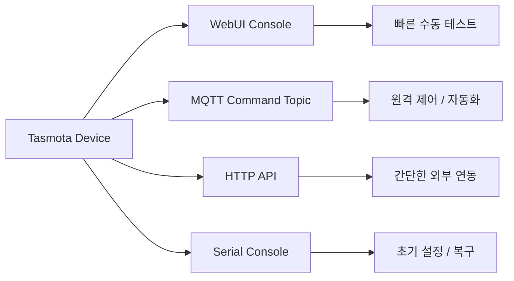
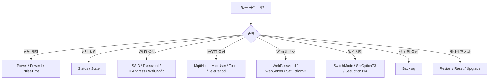

# Tasmota Commands Summary for Smart Plug

## 문서 목적

이 문서는 Tasmota `Commands` 문서 전체 중에서 우리 스마트 플러그 운영과 테스트에 실제로 바로 쓸 가능성이 높은 명령만 추려 정리한 문서다.

정리 기준은 아래와 같다.

1. 어디에서 명령을 넣는지
2. 어떻게 쓰는지
3. 스마트 플러그에서 언제 쓰는지

---

## 1. 명령어는 어디에서 쓰는가

Tasmota 명령은 여러 경로로 실행할 수 있다.

| 방식 | 형식 | 언제 유용한가 |
|---|---|---|
| WebUI Console | 장치 웹페이지의 콘솔에 직접 입력 | 가장 빠른 테스트/설정 |
| MQTT | `cmnd/%topic%/<command>` | 브로커를 통해 원격 제어할 때 |
| HTTP 요청 | `http://<ip>/cm?cmnd=<command>` | 간단한 API처럼 쓸 때 |
| Serial | 시리얼 콘솔에서 직접 입력 | 초기 설정, 복구, 디버깅 |
| Backlog | 여러 명령을 한 줄에 연속 실행 | 최초 세팅 자동화 |

### 가장 많이 쓰게 될 입력 위치



---

## 2. 기본 명령 형식

### WebUI Console

```text
Power ON
Status 0
MqttHost 192.168.0.15
```

### MQTT

```text
Topic: cmnd/<topic>/Power
Payload: ON
```

예:

```text
Topic: cmnd/smartplug01/Power
Payload: ON
```

### HTTP

```text
http://<ip>/cm?cmnd=Power%20ON
```

비밀번호가 있을 경우:

```text
http://<ip>/cm?user=admin&password=1234&cmnd=Power%20ON
```

### Backlog

```text
Backlog MqttHost 192.168.0.15; MqttUser user; MqttPassword pass; Topic plug01
```

---

## 3. 스마트 플러그에서 가장 먼저 알아야 하는 핵심 명령

| 분류 | 명령 | 용도 |
|---|---|---|
| 전원 | `Power`, `Power1`, `PulseTime` | 릴레이 제어 |
| 상태 확인 | `Status`, `State` | 장치 상태 조회 |
| Wi-Fi | `SSID1`, `Password1`, `IPAddress1~5`, `WifiConfig`, `WebServer`, `WebPassword` | 네트워크 설정 |
| MQTT | `MqttHost`, `MqttPort`, `MqttUser`, `MqttPassword`, `Topic`, `TelePeriod` | MQTT 연결 및 상태 송신 |
| 버튼/스위치 | `SwitchMode`, `SwitchText`, `ButtonTopic`, `SwitchTopic`, `SetOption73`, `SetOption114` | 입력 제어 |
| 관리 | `Restart`, `Reset`, `OtaUrl`, `Upgrade` | 재시작, 초기화, OTA |
| UI/보안 | `WebPassword`, `WebServer`, `SetOption53` | WebUI 접근 제한 |

---

## 4. 스마트 플러그에서 자주 쓸 명령 정리

## 4-1. 전원 제어

| 명령 | 예시 | 의미 |
|---|---|---|
| `Power` | `Power ON` | 첫 번째 릴레이 켜기 |
| `Power OFF` | `Power OFF` | 첫 번째 릴레이 끄기 |
| `Power TOGGLE` | `Power TOGGLE` | 현재 상태 반전 |
| `Power1 ON` | `Power1 ON` | 첫 번째 릴레이 명시적으로 켜기 |
| `PulseTime1 120` | `PulseTime1 120` | 일정 시간 뒤 자동 OFF |

### 언제 쓰는가

| 상황 | 명령 |
|---|---|
| 릴레이 수동 테스트 | `Power ON`, `Power OFF` |
| ON/OFF 상태 확인 | `Power` |
| 잠깐만 켜야 하는 경우 | `PulseTime1 <value>` |

---

## 4-2. 상태 확인

| 명령 | 예시 | 의미 |
|---|---|---|
| `State` | `State` | 현재 장치 상태 확인 |
| `Status 0` | `Status 0` | 전체 상태 정보 확인 |
| `Status 5` | `Status 5` | 네트워크 정보 확인 |
| `Status 6` | `Status 6` | MQTT 정보 확인 |
| `Status 11` | `Status 11` | TelePeriod와 유사한 상태 정보 확인 |

### 추천 사용법

| 확인 목적 | 추천 명령 |
|---|---|
| 장치 전체 상태 | `Status 0` |
| 현재 IP/게이트웨이/DNS | `Status 5` |
| MQTT 연결 상태 | `Status 6` |
| 릴레이/센서 상태 | `State`, `Status 11` |

---

## 4-3. Wi-Fi 설정

| 명령 | 예시 | 의미 |
|---|---|---|
| `SSID1` | `SSID1 MyWifi` | 1번 AP SSID 설정 |
| `Password1` | `Password1 MyPass1234` | 1번 AP 비밀번호 설정 |
| `SSID2` | `SSID2 BackupWifi` | 2번 AP SSID 설정 |
| `Password2` | `Password2 BackupPass` | 2번 AP 비밀번호 설정 |
| `IPAddress1` | `IPAddress1 192.168.0.50` | 장치 IP 설정 |
| `IPAddress2` | `IPAddress2 192.168.0.1` | 게이트웨이 설정 |
| `IPAddress3` | `IPAddress3 255.255.255.0` | 서브넷 설정 |
| `IPAddress4` | `IPAddress4 8.8.8.8` | DNS 설정 |
| `WifiConfig 2` | `WifiConfig 2` | Wi-Fi Manager(AP 모드) 진입 |
| `Restart 1` | `Restart 1` | 네트워크 설정 적용 위해 재시작 |

### 동적 IP vs 고정 IP

| 목적 | 설정 |
|---|---|
| DHCP 사용 | `IPAddress1 0.0.0.0` |
| 고정 IP 사용 | `IPAddress1~4` 설정 후 `Restart 1` |

### Wi-Fi 복구 테스트에 유용한 명령

| 명령 | 의미 |
|---|---|
| `Status 5` | 현재 네트워크 상태 확인 |
| `Ping4 192.168.0.1` | 게이트웨이 도달 여부 확인 |
| `Ap 1` / `Ap 2` | AP 전환 테스트 |

---

## 4-4. MQTT 설정

| 명령 | 예시 | 의미 |
|---|---|---|
| `MqttHost` | `MqttHost 192.168.0.15` | MQTT 브로커 주소 설정 |
| `MqttPort` | `MqttPort 1883` | 브로커 포트 설정 |
| `MqttUser` | `MqttUser pluguser` | MQTT 사용자명 설정 |
| `MqttPassword` | `MqttPassword plugpass` | MQTT 비밀번호 설정 |
| `Topic` | `Topic plug01` | 장치 MQTT topic 설정 |
| `FullTopic` | `FullTopic %prefix%/%topic%/` | topic 구조 설정 |
| `TelePeriod` | `TelePeriod 30` | 상태 publish 주기 설정 |
| `PowerRetain ON` | `PowerRetain ON` | 전원 상태 retain 활성화 |
| `StateRetain ON` | `StateRetain ON` | 상태 retain 활성화 |

### 스마트 플러그 기준 추천 확인 항목

| 목적 | 추천 명령 |
|---|---|
| MQTT 설정 확인 | `Status 6` |
| topic 확인 | `Topic` |
| TelePeriod 확인 | `TelePeriod` |
| retain 정책 확인 | `PowerRetain`, `StateRetain`, `SensorRetain` |

### 초기 MQTT 세팅 예시

```text
Backlog MqttHost 192.168.0.15; MqttPort 1883; MqttUser pluguser; MqttPassword plugpass; Topic plug01; TelePeriod 30
```

---

## 4-5. WebUI 접근 제한 / 보안

이 부분은 우리 운영에서 특히 중요하다.

| 명령 | 예시 | 의미 |
|---|---|---|
| `WebPassword` | `WebPassword pnks1111` | WebUI 비밀번호 설정 |
| `WebServer 1` | `WebServer 1` | 사용자 모드 |
| `WebServer 2` | `WebServer 2` | 관리자 모드 |
| `SetOption53 1` | `SetOption53 1` | WebUI에 호스트/IP 표시 |
| `SetOption53 0` | `SetOption53 0` | WebUI에 호스트/IP 표시 안 함 |

### WebServer 모드 의미

| 설정값 | 의미 |
|---|---|
| `WebServer 0` | 웹 UI 완전 꺼짐 |
| `WebServer 1` | 제한된 사용자 화면 |
| `WebServer 2` | 관리자 화면 |

### 운영 관점 해석

| 목적 | 추천 방향 |
|---|---|
| 로그인 없이 내부 정보 안 보이게 | `WebPassword <pw>` |
| 일반 사용자에게 설정 최소화 | `WebServer 1` 검토 |
| WebUI에서 IP/호스트 표시 줄이기 | `SetOption53 0` |

### 빠른 테스트용 예시

```text
Backlog WebPassword pnks1111; WebServer 2; SetOption53 0
```

주의:

- `WebPassword`는 평문 비밀번호 기반이다
- HTTP 요청에 비밀번호가 포함될 수도 있으므로 내부망 운영이 더 안전하다

---

## 4-6. 버튼/스위치 관련 핵심 명령

이 부분은 앞서 정리한 `Buttons and Switches` 문서와 연결해서 보면 된다.

| 명령 | 예시 | 의미 |
|---|---|---|
| `SwitchMode1 3` | `SwitchMode1 3` | 순간 버튼처럼 동작 |
| `SwitchMode1 15` | `SwitchMode1 15` | 릴레이 분리 + MQTT 송신만 |
| `SwitchText1 Plug_Button` | `SwitchText1 Plug_Button` | JSON 메시지 라벨 변경 |
| `ButtonTopic 0` | `ButtonTopic 0` | 기본 버튼 동작 |
| `SwitchTopic 0` | `SwitchTopic 0` | 기본 스위치 동작 |
| `SetOption73 1` | `SetOption73 1` | 버튼을 릴레이에서 분리 |
| `SetOption114 1` | `SetOption114 1` | 스위치를 릴레이에서 분리 |
| `SetOption32 40` | `SetOption32 40` | HOLD 시간 설정 |
| `SetOption1 1` | `SetOption1 1` | 버튼 multipress 제한 |

### 스마트 플러그에서 특히 중요

| 목적 | 추천 명령 |
|---|---|
| 버튼 오조작 줄이기 | `SetOption1 1` |
| 버튼을 상태 이벤트로만 사용 | `SetOption73 1` |
| 스위치를 MQTT 트리거로만 사용 | `SwitchMode1 15` 또는 `SetOption114 1` |
| HOLD 시간 조정 | `SetOption32 <value>` |

---

## 4-7. OTA / 펌웨어 / 재시작

| 명령 | 예시 | 의미 |
|---|---|---|
| `OtaUrl` | `OtaUrl http://server/firmware.bin` | OTA 주소 설정 |
| `Upgrade 1` | `Upgrade 1` | OtaUrl에서 펌웨어 다운로드 후 업그레이드 |
| `Restart 1` | `Restart 1` | 재시작 |
| `Reset 1` | `Reset 1` | 설정 초기화 후 재시작 |
| `Reset 4` | `Reset 4` | Wi-Fi 유지하고 설정 초기화 |

### 실제로 자주 쓸 가능성

| 상황 | 명령 |
|---|---|
| 설정 반영 위해 재시작 | `Restart 1` |
| OTA 서버 기반 업그레이드 | `OtaUrl ...` + `Upgrade 1` |
| 공장 초기화 유사 테스트 | `Reset 1`, `Reset 4` |

---

## 5. Backlog로 한 번에 세팅하기

Backlog는 여러 명령을 한 줄에서 실행할 수 있어 스마트 플러그 초기 세팅에 매우 유용하다.

### Wi-Fi + MQTT 한 번에 설정

```text
Backlog SSID1 MyWifi; Password1 MyPass1234; MqttHost 192.168.0.15; MqttPort 1883; MqttUser pluguser; MqttPassword plugpass; Topic plug01
```

### WebUI 보호 + 기본 운영 설정

```text
Backlog WebPassword pnks1111; WebServer 2; SetOption53 0; TelePeriod 30
```

### 스위치 입력을 릴레이에서 분리

```text
Backlog SwitchMode1 15; SetOption114 1; SwitchText1 Plug_Button
```

---

## 6. 스마트 플러그 운영에서 바로 써볼 수 있는 실전 묶음

## 6-1. 최초 설치 후 기본 확인

```text
Status 0
Status 5
Status 6
State
```

| 확인 항목 | 명령 |
|---|---|
| 전체 상태 | `Status 0` |
| 네트워크 상태 | `Status 5` |
| MQTT 상태 | `Status 6` |
| 현재 릴레이/센서 상태 | `State` |

## 6-2. Wi-Fi 복구 테스트

```text
Status 5
Ping4 192.168.0.1
State
```

| 확인 항목 | 목적 |
|---|---|
| 현재 IP/게이트웨이 | `Status 5` |
| 공유기 통신 가능 여부 | `Ping4 <gateway>` |
| 장치 정상 동작 여부 | `State` |

## 6-3. 대시보드 연동에 중요한 명령

| 항목 | 명령 |
|---|---|
| 장치 이름 | `FriendlyName1 <name>` |
| 장치 토픽 | `Topic <value>` |
| 장치 표시 이름 | `DeviceName <value>` |
| 상태 publish 주기 | `TelePeriod <sec>` |
| 입력 라벨 | `SwitchText1 <text>` |

예시:

```text
Backlog FriendlyName1 2F-Lab-Plug1; DeviceName 2F-Lab-Plug1; Topic plug_lab_01; TelePeriod 30
```

---

## 7. 명령 선택 플로우



---

## 8. 스마트 플러그 관점에서 가장 먼저 기억할 명령 10개

| 우선순위 | 명령 | 이유 |
|---:|---|---|
| 1 | `Power ON/OFF/TOGGLE` | 릴레이 테스트 기본 |
| 2 | `Status 0` | 전체 상태 한 번에 보기 |
| 3 | `Status 5` | 네트워크/IP 확인 |
| 4 | `Status 6` | MQTT 연결 확인 |
| 5 | `WebPassword` | WebUI 보호 |
| 6 | `WebServer` | 사용자/관리자 모드 |
| 7 | `MqttHost`, `MqttUser`, `MqttPassword` | 브로커 연결 핵심 |
| 8 | `Topic` | 장치 식별 핵심 |
| 9 | `TelePeriod` | 대시보드 상태 주기 |
| 10 | `Backlog` | 초기 세팅 자동화 |

---

## 9. 같이 보면 좋은 관련 문서

| 문서 | 설명 |
|---|---|
| [hardware-analysis.md](./hardware-analysis.md) | ESP 계열 및 Wi-Fi 래퍼 분석 |
| [tasmota-buttons-switches-summary.md](./tasmota-buttons-switches-summary.md) | Button / Switch / SwitchMode 정리 |
| [weekly-workflow-plan-2026-04-15.md](./weekly-workflow-plan-2026-04-15.md) | 이번 주 테스트 및 시연 플랜 |

---

## 최종 결론

Tasmota 명령은 종류가 매우 많지만, 우리 스마트 플러그 기준으로는 전부 외울 필요는 없다.

우선은 아래 6개 축으로 나눠서 보면 된다.

1. 전원 제어
2. 상태 확인
3. Wi-Fi 설정
4. MQTT 설정
5. WebUI 보호
6. 입력(Button/Switch) 제어

초기 설정이나 반복 작업은 `Backlog`로 묶고, 실사용/테스트 단계에서는 `Status 0`, `Status 5`, `Status 6`, `Power`, `WebPassword`, `Topic`, `TelePeriod` 정도를 가장 먼저 익히는 것이 효율적이다.
