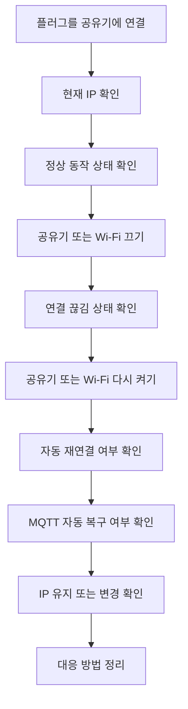
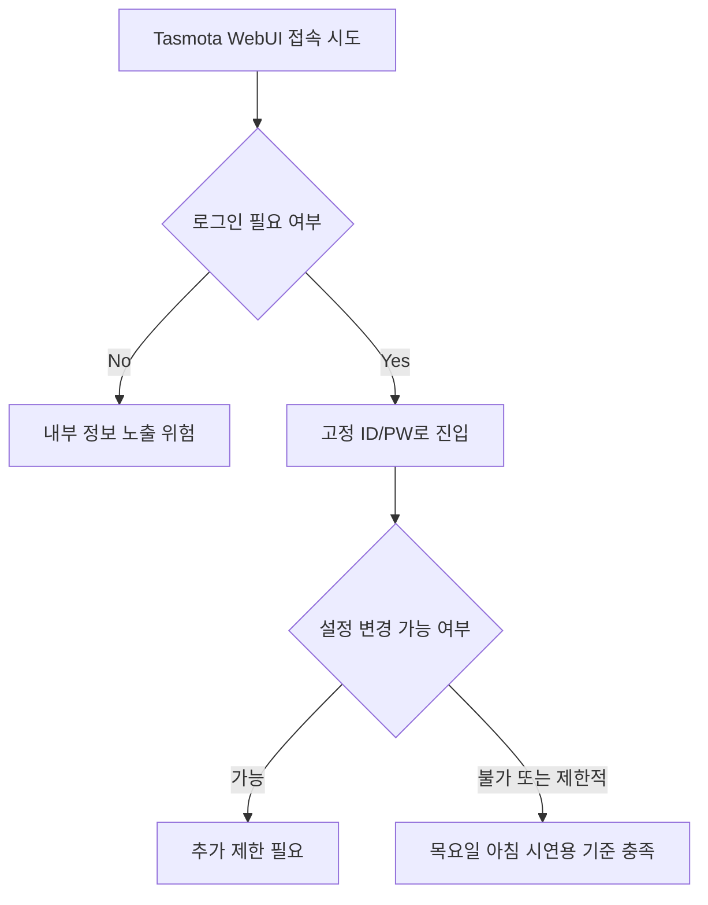
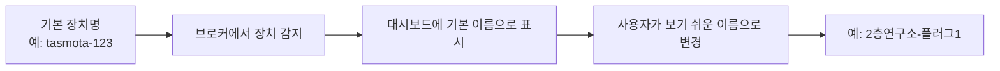
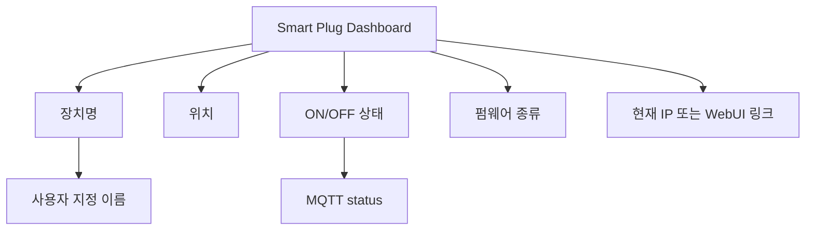

# Smart Plug Weekly Workflow Plan

## 문서 목적

이 문서는 `2026-04-15(수)`부터 `2026-04-17(금)`까지 진행할 스마트 플러그 테스트/시연 준비 플랜을 정리한 문서다.

지금 우선순위는 아래 3가지다.

1. Wi-Fi 장애/복구 테스트
2. Tasmota WebUI 접근 제한
3. 러프한 스마트 플러그 대시보드 제작

`현재 코드 문제점 브레인스토밍`과 `자체 펌웨어 고도화`는 이번 문서 범위에서 제외하고, 이후 별도 작업으로 본다.

---

## 이번 주 목표

| 항목 | 목표 시점 | 결과물 |
|---|---|---|
| 러프한 중간 결과 공유 | `2026-04-16(목) 아침` | Wi-Fi 테스트 결과 초안, WebUI 보호 방향, 대시보드 러프 버전 |
| 실사용 워크플로우 정리 | `2026-04-17(금)` | 사용자처럼 설치/이동/복구하는 흐름 설명 자료 |
| 현장/테스트 증빙 확보 | `2026-04-17(금)` | 사진, 짧은 영상, 체크리스트 결과 |

---

## 이번 주에 먼저 신경 써야 하는 것

| 구분 | 내용 |
|---|---|
| 설치 흐름 | 처음 플러그를 설치할 때 우리가 직접 무엇을 해야 하는지 |
| 네트워크 복구 | 공유기 또는 Wi-Fi가 끊겼다가 다시 켜질 때 자동 복구되는지 |
| IP 변화 | IP가 바뀌는지, 바뀌면 어떻게 다시 찾을지 |
| 보안/접근 | 사용자가 Tasmota 내부 정보와 설정을 못 보게 할 수 있는지 |
| 대시보드 | 위치, 이름, ON/OFF 상태를 최소한으로 보여줄 수 있는지 |
| 공간 이동 | A 공간에서 B 공간으로 장치를 옮겼을 때 다시 운영 가능한지 |
| 브로커 기준 | `EMQX` 기준으로 우선 테스트하되, 현재 브로커 구조도 같이 확인할지 |

---

## 목요일 아침까지 끝내야 하는 3가지

| 우선순위 | 작업 | 완료 기준 |
|---:|---|---|
| 1 | Wi-Fi 테스트 | 장애/복구 시나리오별 결과가 표로 정리되어 있음 |
| 2 | Tasmota WebUI 접근 제한 | 최소한 로그인 전에는 내부 정보가 안 보이는 구조 초안이 있음 |
| 3 | 스마트 플러그 대시보드 러프 버전 | 장치명, 위치, ON/OFF 상태가 보이는 화면 초안이 있음 |

---

## 1. Wi-Fi 테스트에서 확인할 것

| 테스트 항목 | 확인할 내용 | 중요 이유 |
|---|---|---|
| 공유기 OFF -> ON | 플러그가 자동 재연결되는지 | 사람이 다시 만지지 않아도 되는지 확인 |
| Wi-Fi만 순간 끊김 | MQTT까지 자동 복구되는지 | 실사용에서 자주 생길 수 있음 |
| 재부팅 후 재연결 | 다시 같은 네트워크에 붙는지 | 현장 복구 기본 동작 |
| IP 유지 여부 | IP가 유지되는지, 바뀌는지 | WebUI 진입 방식에 영향 |
| IP가 바뀔 때 대응 | 관리자 페이지 없이 장치를 다시 찾을 수 있는지 | 운영 난이도와 직결 |
| 다른 공유기로 이동 | A에서 B로 옮겼을 때 다시 붙는지 | 공간 이동 시나리오 핵심 |

### Wi-Fi 테스트 시나리오



### Wi-Fi 테스트 결과를 정리할 표

| 케이스 | 예상 | 실제 결과 | 문제 여부 | 메모 |
|---|---|---|---|---|
| 공유기 재시작 | 자동 재연결 |  |  |  |
| Wi-Fi 잠깐 끊김 | 자동 복구 |  |  |  |
| 플러그 재부팅 | 같은 설정으로 재연결 |  |  |  |
| A -> B 이동 | 다시 설정 필요 여부 확인 |  |  |  |
| IP 변경 | 다시 찾는 방법 필요 |  |  |  |

---

## 2. Tasmota WebUI 접근 제한에서 확인할 것

### 목표

- 로그인 전에는 내부 정보가 보이지 않게 하기
- 사용자가 포트, 브로커 주소, username 같은 값을 못 보거나 못 바꾸게 하기
- 시간상 완전한 역할 분리가 어렵다면, 우선 `WebUI 진입 자체를 로그인 기반으로 제한`하는 쪽을 먼저 검토하기

### 현재 목요일 아침까지 필요한 방향

| 항목 | 우선 방향 |
|---|---|
| 1차 목표 | WebUI 들어가기 전에 ID/PW 입력 |
| 임시 계정 | `ID: pnkmem433`, `PW: pnks1111` |
| 이유 | 서버/DB 없이 고정 계정으로 빠르게 검증 가능 |
| 최소 기준 | 로그인 안 하면 내부 정보 안 보임 |
| 추가 기준 | 들어가더라도 일반 사용자가 설정 변경을 못 하게 할 수 있는지 확인 |

### WebServer 모드 정리

| 설정값 | 의미 |
|---|---|
| `WebServer 0` | 웹 UI 완전 꺼짐 |
| `WebServer 1` | 제한된 사용자 화면 |
| `WebServer 2` | 관리자 화면 |

### 로그인 동작 정리

| 구분 | 내용 |
|---|---|
| Tasmota 기본 WebUI | 한 번 로그인하면 브라우저/IP 기준으로 계속 신뢰하는 동작이 있음 |
| Tasmota 예외 | `minimal -> 본 펌웨어 OTA` 전환 시 다시 로그인 필요 |
| Tasmota 예외 2 | WebUI에서 재부팅하면 다시 로그인 요구 가능 |
| 자체제작 ESP | OTA 시 로그인 없음 |
| 자체제작 ESP | MQTT 명령 시에만 인증 필요 |

### 현재 판단

| 항목 | 정리 |
|---|---|
| 기본 WebUI 방식 한계 | 세션/접근 제어가 우리가 원하는 수준으로 일관적이지 않음 |
| 보안 리스크 | 사용자가 직접 Tasmota WebUI에 접근하면 내부 정보 노출 가능성이 남음 |
| 권장 방향 | 사용자는 Tasmota WebUI에 직접 접근하지 않도록 하고, 별도의 커스텀 UI를 통해 필요한 기능만 제공 |
| 관리 방식 | 실제 제어는 MQTT 또는 제한된 API로 수행 |

### 접근 제한 검토 흐름



### 여기서 바로 확인해야 할 질문

| 질문 | 확인 목적 |
|---|---|
| 로그인 전 화면에서 어떤 정보가 보이는가 | 노출 범위 확인 |
| 로그인 후 어떤 메뉴까지 접근 가능한가 | 관리자/사용자 구분 가능성 확인 |
| MQTT 정보가 그대로 보이는가 | 보안 민감 정보 노출 여부 확인 |
| 수정 버튼을 막을 수 있는가 | 오조작 방지 가능성 확인 |

---

## 3. 러프한 스마트 플러그 대시보드에서 필요한 것

### 목요일 아침 기준 최소 기능

| 기능 | 설명 |
|---|---|
| 장치 목록 | 어떤 플러그가 연결되어 있는지 보이기 |
| 장치명 | 처음엔 기본 이름, 이후 사람이 이름 변경 가능 |
| 위치 | 예: `A 공간`, `B 공간`, `2층연구소-플러그1` |
| 상태 | 현재 `ON/OFF` |
| 연결 기준 | 브로커에 살아있는 장치만 표시 |

### 있으면 좋은 기능

| 기능 | 설명 |
|---|---|
| 클릭 시 WebUI 진입 | 같은 Wi-Fi에 있을 때만 현실적으로 가능할 수 있음 |
| 현재 IP 표시 | WebUI 이동이나 문제 확인에 도움 |
| 펌웨어 종류 표시 | `Tasmota` / `Custom` 구분 |
| 마지막 응답 시간 | 장치가 살아있는지 확인 가능 |

### 장치 이름 흐름



### 대시보드 구조 초안



---

## 목요일 아침까지의 실행 순서

이 순서대로 가면 `2026-04-16(목) 아침`까지 최소 결과를 보여주기 좋다.

| 순서 | 작업 | 목표 산출물 |
|---:|---|---|
| 1 | Wi-Fi 테스트 케이스 확정 | 테스트 표 초안 |
| 2 | 공유기 끊김/복구 테스트 진행 | 자동 복구 여부 결과 |
| 3 | IP 변화 여부 기록 | IP 관련 리스크 정리 |
| 4 | Tasmota WebUI 로그인/보호 가능성 확인 | 보호 방향 초안 |
| 5 | 대시보드에 필요한 데이터 항목 확정 | 장치명/위치/상태 목록 |
| 6 | 러프한 대시보드 화면 제작 | 시연 가능한 초안 |
| 7 | 사진/영상 촬영 포인트 정리 | 수/목 중간 공유 자료 |

---

## 날짜별 플래너

## `2026-04-15(수)`

### 오늘 꼭 해야 할 것

| 구분 | 작업 |
|---|---|
| 1 | Wi-Fi 테스트 케이스 표 만들기 |
| 2 | 실제 공유기 끊김/복구 테스트 1차 진행 |
| 3 | IP가 바뀌는지, 찾는 방법이 있는지 기록 |
| 4 | Tasmota WebUI 로그인/관리자 모드 가능성 확인 |
| 5 | 대시보드에 표시할 필드 정의 |

### 오늘 끝나면 남겨야 하는 것

| 산출물 | 내용 |
|---|---|
| 테스트 메모 | 케이스별 실제 동작 |
| 캡처 | WebUI 노출 범위, MQTT 상태, IP 변화 |
| 결정 초안 | 목요일 아침에 보여줄 기준 |

## `2026-04-16(목) 아침`

### 보여줄 수 있어야 하는 것

| 항목 | 최소 기준 |
|---|---|
| Wi-Fi 테스트 | 끊김/복구 결과가 한눈에 보이는 표 |
| WebUI 보호 | 로그인 또는 접근 제한 방향 설명 가능 |
| 대시보드 | 최소한 장치명/위치/상태가 보이는 화면 |

## `2026-04-16(목) 낮~저녁`

### 이어서 할 것

| 항목 | 내용 |
|---|---|
| 테스트 보완 | 오전 피드백 반영 |
| 대시보드 정리 | 이름 변경, 장치 표시 방식 보완 |
| 시연 자료 준비 | 사진, 영상, 설명 문구 정리 |

## `2026-04-17(금)`

### 최종 시연 목표

| 항목 | 보여줄 내용 |
|---|---|
| 설치 흐름 | AP 접속 -> Wi-Fi 연결 -> MQTT 반영 |
| 사용자 사용 흐름 | 대시보드에서 장치 확인, ON/OFF 확인 |
| 장애 복구 흐름 | 공유기 껐다 켜도 다시 붙는지 |
| 공간 이동 흐름 | A -> B 이동 후 다시 운영 가능한지 |

---

## 현장에서 사진/영상으로 남기면 좋은 장면

| 장면 | 왜 필요한가 |
|---|---|
| AP 잡는 화면 | 초기 설치 흐름 증빙 |
| Wi-Fi 설정 화면 | 우리가 직접 하는 초기 작업 설명용 |
| 대시보드에 장치 뜨는 화면 | 연결 성공 증빙 |
| ON/OFF 상태 변화 | 사용자 관점 시연용 |
| 공유기 끊김 후 복구 | 안정성 증빙 |
| A/B 이동 후 재동작 | 워크플로우 핵심 증빙 |

---

## 문서/공유 방식

### 앞으로 문서 정리 방식

| 항목 | 권장 방식 |
|---|---|
| 문서 위치 | `docs/` 아래에 날짜 또는 주제별 `.md` 파일 |
| 구조 시각화 | Mermaid 사용 |
| 캡처 이미지 | `docs/assets/` 폴더에 저장 후 Markdown에 삽입 |
| 공유 방법 | Git에 커밋/푸시해서 링크 공유 |

### Markdown에 이미지 넣는 방식

```md

```

### 추천 VS Code 확장

| 확장 | 용도 |
|---|---|
| `Markdown All in One` | 목차, 단축키, 문서 편집 편의 |
| `Markdown Preview Mermaid Support` | Mermaid 다이어그램 미리보기 |
| `Paste Image` | 캡처 이미지를 바로 문서 폴더에 저장하고 Markdown 링크 생성 |
| `markdownlint` | 표와 문서 포맷 정리 |

---

## 빠른 결론

목요일 `2026-04-16` 아침까지는 아래 3가지를 보여줄 수 있으면 된다.

1. Wi-Fi가 끊겼다 다시 살아났을 때 스마트 플러그가 어떻게 동작하는지
2. Tasmota WebUI에 들어가기 전에 로그인 또는 접근 제한을 걸 수 있는지
3. 장치명, 위치, ON/OFF 상태가 보이는 러프한 대시보드가 있는지

지금은 완성도보다도 `한눈에 보이는 검증 결과`와 `보여줄 수 있는 화면/증빙`이 더 중요하다.
