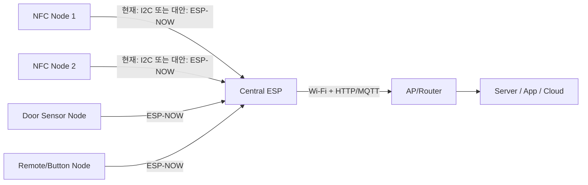
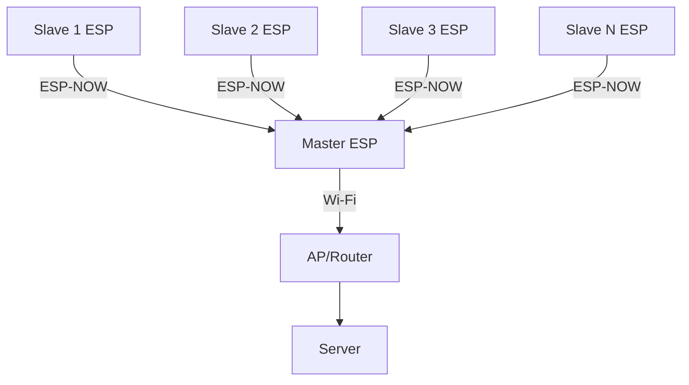
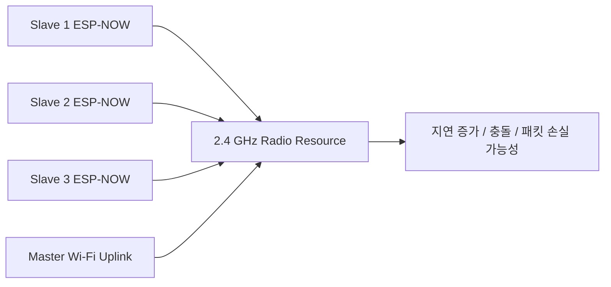
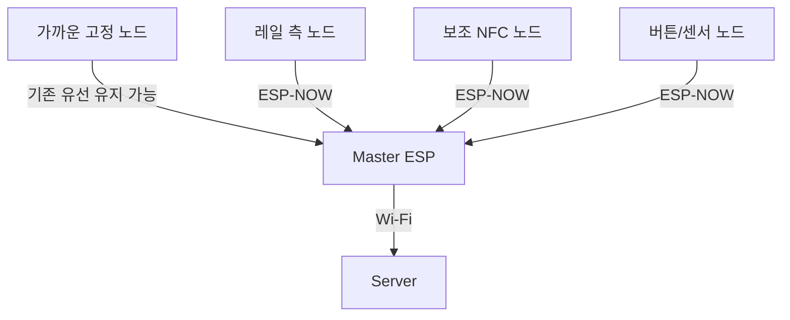

# ESP-NOW 검토 정리

부제: 스마트 행거 관점에서 "어떤 칩에서, 어떤 구조로, 어디에 쓰고, 무엇을 주의해야 하는가"

## 0. 참고한 공식 출처

가장 먼저 참고한 문서는 아래다.

1. [Seeed Studio Wiki, ESP-NOW on XIAO ESP32 Series](https://wiki.seeedstudio.com/xiao_espnow/)
2. [Espressif Solutions Page, Wireless Communication Protocol (ESP-NOW)](https://www.espressif.com/en/solutions/low-power-solutions/esp-now)
3. [ESP-NOW SDK Introduction](https://docs.espressif.com/projects/esp-now/en/latest/introduction.html)
4. [ESP-IDF Programming Guide, ESP-NOW](https://docs.espressif.com/projects/esp-idf/en/stable/esp32/api-reference/network/esp_now.html)
5. [ESP-FAQ, ESP-NOW](https://docs.espressif.com/projects/esp-faq/en/latest/application-solution/esp-now.html)
6. [Arduino ESP32 ESP-NOW API](https://docs.espressif.com/projects/arduino-esp32/en/latest/api/espnow.html)
7. [ESP-NOW GitHub Repository](https://github.com/espressif/esp-now)
8. [PlatformIO espressif32](https://docs.platformio.org/en/latest/platforms/espressif32.html)
9. [PlatformIO espressif8266](https://docs.platformio.org/en/stable/platforms/espressif8266.html)
10. [ESP32-C3 Datasheet](https://documentation.espressif.com/esp32-c3_datasheet_en.html)
11. [ESP8685 Datasheet](https://documentation.espressif.com/esp8685_datasheet_en.html)
12. [ESP8266EX Datasheet](https://documentation.espressif.com/0a-esp8266ex_datasheet_en.html)

---

## 1. 결론 먼저

### 핵심 결론

ESP-NOW는 하드웨어 부품이 아니라, ESP 칩의 2.4 GHz Wi-Fi 라디오 위에서 동작하는 장치 간 직접 통신 방식이다.

스마트 행거 관점에서 보면, ESP-NOW는 "마지막 마스터 ESP의 서버 업링크"를 대체하는 기술이 아니라, "현재 유선으로 연결된 슬레이브-마스터 내부 링크"를 무선화할 때 검토할 기술이다.

### 한눈에 보는 결론

| 항목 | 결론 |
| --- | --- |
| ESP-NOW 정체 | ESP 칩의 Wi-Fi 하드웨어를 이용한 로컬 장치 간 직접 통신 프로토콜 |
| 인터넷/서버 전송 가능 여부 | 직접은 불가. 보통 마스터 ESP가 받아서 일반 Wi-Fi로 서버 전송 |
| 지원 칩 계열 | Espressif 공식 문서 기준 ESP8266, ESP32, ESP32-S, ESP32-C |
| XIAO ESP32C3 사용 가능 여부 | 가능 |
| ESP-02S 사용 가능 여부 | 가능. Bluetooth 없어도 가능 |
| 스마트 행거에 가장 맞는 용도 | 슬레이브의 짧은 이벤트를 마스터로 전달하는 내부 무선 링크 |
| 스마트 행거에서 유지해야 할 것 | 마스터 ESP의 서버 연결은 기존처럼 일반 Wi-Fi 유지 |
| 현재 구조를 전부 바꿔야 하나 | 아니다. 하이브리드 적용이 더 현실적 |
| 가장 큰 장점 | 배선 감소, 구조 유연성 증가, 이동부 대응 용이 |
| 가장 큰 단점 | 무선 간섭, 충돌 관리 필요, 금속 구조물 영향, 디버깅 난이도 증가 |

### 발표용 한 줄

ESP-NOW는 ESP들끼리 직접 통신하는 로컬 무선 방식이고, 스마트 행거에서는 모든 통신을 바꾸는 기술이라기보다 슬레이브-마스터 내부 통신을 무선화할 때 검토할 기술로 보는 것이 맞다.

---

## 2. 현재 스마트 행거 구조와 ESP-NOW 적용 구조

### 현재 구조

현재 스마트 행거는 여러 슬레이브 ESP와 디스플레이가 유선으로 연결되고, 그 정보가 마지막 마스터 ESP로 전달된 뒤, 마스터 ESP가 일반 Wi-Fi로 서버와 통신하는 구조로 이해하는 것이 맞다.



### ESP-NOW 적용 시 구조

ESP-NOW를 적용하면, 슬레이브와 마스터 사이 내부 통신 구간을 무선으로 바꾸고, 마스터에서 서버로 가는 마지막 구간은 여전히 일반 Wi-Fi로 유지하는 형태가 된다.



### 구조 비교

| 구간 | 현재 방식 | ESP-NOW 적용 시 | 판단 |
| --- | --- | --- | --- |
| 슬레이브 ↔ 마스터 | 유선 내부 통신 | ESP-NOW | 교체 후보 |
| 마스터 ↔ 서버 | 일반 Wi-Fi | 일반 Wi-Fi | 유지 권장 |
| 주소 체계 | 버스 주소 기반 | MAC 주소 기반 | 설계 변경 필요 |
| 충돌 처리 | 유선이라 구조적으로 단순 | 무선이라 질서 설계 필요 | ESP-NOW 쪽이 어려움 |
| 배선 | 많음 | 줄어듦 | ESP-NOW 장점 |
| 설치 유연성 | 낮음 | 높음 | ESP-NOW 장점 |

### 핵심 해석

중요한 포인트는 "ESP-NOW를 쓰더라도 마지막 마스터 ESP는 일반 Wi-Fi로 인터넷과 서버에 연결되어야 한다"는 점이다.

즉, 아래 비교가 정확하다.

| 비교 대상 | 올바른 비교인가 |
| --- | --- |
| 일반 Wi-Fi vs ESP-NOW를 시스템 전체 대체 관계로 비교 | 부정확 |
| 마스터의 서버 업링크는 일반 Wi-Fi, 슬레이브 내부 링크는 ESP-NOW로 역할 분리 | 정확 |

---

## 3. ESP-NOW를 사용할 수 있는 칩 모델

Espressif 공식 문서 기준 지원 계열은 아래와 같다.

| 공식 지원 계열 | 예시 |
| --- | --- |
| ESP8266 계열 | ESP-02S, ESP8266EX 기반 모듈 |
| ESP32 계열 | ESP32 DevKit 계열 |
| ESP32-S 계열 | ESP32-S2, ESP32-S3 계열 |
| ESP32-C 계열 | ESP32-C2, ESP32-C3, ESP8685 계열 |

### 질문받을 가능성이 높은 모델 정리

| 보드/칩 | ESP-NOW 가능 여부 | 근거 |
| --- | --- | --- |
| XIAO ESP32C3 | 가능 | ESP32-C3는 ESP32-C 계열 |
| ESP8685 기반 보드 | 가능 | ESP8685는 ESP32-C 계열 |
| ESP-02S | 가능 | 일반적으로 ESP8266EX 기반, ESP8266 계열 |
| Bluetooth 없는 ESP8266 | 가능 | ESP-NOW는 Bluetooth 기반이 아니라 Wi-Fi 기반 |

### 결론

ESP-NOW는 "Bluetooth가 있어야 되는 기능"이 아니라 "Espressif Wi-Fi 하드웨어 위에서 동작하는 기능"이다.

---

## 4. 지원 여부를 어떻게 확인하나

지원 여부는 "데이터시트"와 "SDK 문서"를 같이 봐야 한다.

### 1. 데이터시트에서 볼 것

데이터시트는 하드웨어 기반 확인용이다.

| 데이터시트에서 찾을 표현 | 의미 |
| --- | --- |
| 2.4 GHz Wi-Fi | Wi-Fi 무선 하드웨어 있음 |
| 802.11 b/g/n | Wi-Fi 규격 기반 MAC/PHY 지원 |
| Wi-Fi SoC | Wi-Fi 기능 내장 칩 |
| Wi-Fi networking capabilities | 네트워크 기능 수행 가능 |
| Wi-Fi MAC | Wi-Fi 계층 존재 |
| STA / SoftAP | Wi-Fi 인터페이스 역할 지원 |

### 2. SDK 문서에서 볼 것

SDK 문서는 실제 개발 가능 여부 확인용이다.

| SDK에서 볼 항목 | 의미 |
| --- | --- |
| ESP-NOW 문서 섹션 존재 | 공식 지원 여부 |
| `esp_now.h` | API 헤더 존재 |
| `esp_now_init()` | 초기화 가능 |
| `esp_now_send()` | 송신 가능 |
| `esp_now_add_peer()` | peer 등록 가능 |
| `esp_now_register_recv_cb()` | 수신 콜백 가능 |
| 예제 코드 존재 | 실제 사용 가능성 높음 |

### 최종 판단법

| 체크 단계 | 질문 |
| --- | --- |
| 1단계 | 이 칩 데이터시트에 Wi-Fi 하드웨어가 있는가 |
| 2단계 | 내가 쓰는 SDK/프레임워크에 ESP-NOW API가 있는가 |
| 3단계 | 내 개발환경에서 그 API를 실제로 빌드할 수 있는가 |

### 발표용 문장

데이터시트는 "이 칩에 Wi-Fi 하드웨어가 있느냐"를 확인하는 용도이고, SDK 문서는 "그 Wi-Fi 위에서 ESP-NOW를 실제 개발할 수 있느냐"를 확인하는 용도다.

---

## 5. PlatformIO 기준으로 어디를 보면 되나

현재 프로젝트는 PlatformIO 기반이고, 로컬 프로젝트 설정상 XIAO ESP32C3 + Arduino 조합이다.

### 현재 프로젝트 기준

| 항목 | 현재 프로젝트 |
| --- | --- |
| platform | `espressif32` |
| board | `seeed_xiao_esp32c3` |
| framework | `arduino` |

### 확인 순서

| 순서 | 확인할 것 | 목적 |
| --- | --- | --- |
| 1 | `platformio.ini` | platform / board / framework 확인 |
| 2 | board 문서 | 실제 칩 확인 |
| 3 | PlatformIO platform 문서 | 빌드 생태계 확인 |
| 4 | Arduino ESP32 ESP-NOW 문서 | 현재 환경에 맞는 API 확인 |
| 5 | ESP-IDF ESP-NOW 문서 | 더 저수준 동작 확인 |

### 중요한 정리

라이브러리 이름만 같다고 해서 같은 방식으로 개발되는 것이 아니다.

정확히는 아래 조합을 같이 봐야 한다.

| 봐야 할 요소 | 이유 |
| --- | --- |
| 칩 | 하드웨어 지원 여부 결정 |
| 프레임워크 | API 스타일 결정 |
| 코어/SDK 버전 | 콜백 타입, 함수명, 예제 스타일 차이 가능 |
| PlatformIO platform | 어떤 툴체인과 패키지를 쓰는지 결정 |

### 발표용 문장

ESP32와 ESP8266 모두 ESP-NOW 자체는 가능하지만, 실제 구현은 칩만 보는 게 아니라 칩 + 프레임워크 + 코어 버전 조합으로 판단해야 한다.

---

## 6. ESP-NOW는 어떤 방식의 통신인가

ESP-NOW는 Espressif가 정의한 connectionless Wi-Fi communication protocol이다.

쉽게 말하면, ESP 안의 기존 2.4 GHz Wi-Fi 라디오를 사용하지만, 일반 Wi-Fi처럼 공유기에 붙어서 IP/TCP/HTTP로 통신하는 것이 아니라, MAC 주소 기반으로 ESP끼리 직접 짧은 데이터를 주고받는 방식이다.

### 일반 Wi-Fi와 비교

| 항목 | 일반 Wi-Fi | ESP-NOW |
| --- | --- | --- |
| 공유기 필요 | 보통 필요 | 필요 없음 |
| IP 주소 필요 | 필요 | 불필요 |
| TCP/UDP/HTTP/MQTT | 사용 | 사용하지 않음 |
| 주소 기준 | IP 주소 | MAC 주소 |
| 주 용도 | 서버/인터넷 연동 | ESP 장치 간 직접 통신 |
| 구조 | AP 중심 | peer-to-peer 중심 |

### 핵심 해석

ESP-NOW는 인터넷 프로토콜이 아니다.

따라서 서버나 인터넷으로 직접 보내는 용도는 아니고, 보통 아래 구조로 사용한다.


---

## 7. 속도는 어느 정도인가

### 공식 문서 기준 수치

| 항목 | 공식 수치 |
| --- | --- |
| ESP-NOW 기본 PHY rate | 1 Mbps |
| ESP32 one-to-one 열린 환경 | 약 214 Kbps |
| ESP32 one-to-one 차폐 환경 | 약 555 Kbps |

출처는 ESP-IDF Programming Guide와 ESP-FAQ다.

### 현재 스마트 행거 방식과 비교

현재 로컬 코드 기준으로 스마트 행거 내부 통신은 I2C 100 kHz 설정을 사용하고 있다.

하지만 아래처럼 단순 숫자 비교로 결론내리면 안 된다.

| 비교 항목 | 현재 유선 구조 | ESP-NOW |
| --- | --- | --- |
| 전송 매체 | 유선 | 무선 |
| 기준 속도 숫자 | I2C 100 kHz | PHY 1 Mbps |
| 실제 체감 안정성 | 높음 | 환경 의존 |
| 지연 편차 | 작음 | 무선 상태 따라 변동 가능 |
| 대용량 전송 적합성 | 낮음 | 역시 낮음 |
| 짧은 이벤트 전달 | 충분 | 충분 |

### 해석

ESP-NOW는 "짧은 이벤트 전달에는 충분히 빠르다"고 말하는 것은 안전하지만, "현재 유선 I2C보다 전체적으로 더 빠르고 더 안정적이다"라고 말하는 것은 조심해야 한다.

왜냐하면 무선은 아래 요소를 같이 받기 때문이다.

| 속도에 영향을 주는 요소 | 영향 |
| --- | --- |
| 패킷 손실 | 재전송 발생 |
| AP와의 공존 | 자원 경쟁 발생 |
| 슬레이브 수 증가 | 충돌 가능성 증가 |
| 금속 구조물 | RSSI 저하 |
| 채널 혼잡 | 지연 증가 |

### 발표용 문장

ESP-NOW는 NFC 이벤트나 버튼 입력처럼 짧은 데이터 전달에는 충분히 빠르지만, 유선 통신처럼 항상 일정한 지연과 안정성을 기대하기보다는 무선 환경에 따라 성능이 달라지는 구조로 이해해야 한다.

---

## 8. Wi-Fi와 같은 2.4 GHz를 쓰는데 간섭은 없나

간섭이 없다고 보면 안 된다.

ESP-NOW도 Wi-Fi 하드웨어 위에서 동작하므로, 마스터가 서버와 일반 Wi-Fi로 통신하고 슬레이브들이 ESP-NOW로 마스터에 데이터를 보내면 결국 같은 2.4 GHz 자원을 공유하게 된다.

### 공식 문서 기준

ESP-FAQ는 아래를 명확히 말한다.

| 공식 내용 | 의미 |
| --- | --- |
| Wi-Fi와 ESP-NOW 동시 사용 가능 | 공존 가능 |
| 단, ESP-NOW 채널은 연결된 AP 채널과 같아야 함 | 완전 독립은 아님 |

### 스마트 행거에서 생각해야 할 간섭

| 간섭 지점 | 설명 |
| --- | --- |
| 슬레이브 간 ESP-NOW 충돌 | 여러 슬레이브가 동시에 보낼 수 있음 |
| 마스터 ESP-NOW vs 마스터 Wi-Fi 업링크 | 같은 라디오 자원 공유 |
| 주변 일반 Wi-Fi 환경 | 매장 공유기, AP 간섭 가능 |
| 금속 레일/하우징 | 신호 감쇠 가능 |



### 결론

Wi-Fi와 ESP-NOW는 함께 쓸 수는 있지만, 서로 완전히 영향이 없는 별도 통신망이라고 보면 안 된다.

---

## 9. 슬레이브가 많을 때 충돌은 어떻게 처리하나

### 현재 유선 구조의 장점

현재 유선 구조는 본질적으로 마스터 중심 구조라서, 통신 질서가 자연스럽게 생긴다.

즉, 마스터가 순서를 만들고 슬레이브가 그 순서에 맞춰 응답하는 방식이면 충돌 제어가 비교적 쉽다.

### ESP-NOW로 바꾸면 달라지는 점

ESP-NOW는 무선이므로, 슬레이브가 많아질수록 애플리케이션 레벨에서 통신 질서를 직접 설계해야 한다.

공식 문서에서 확인되는 포인트는 아래와 같다.

| 공식 문서 포인트 | 의미 |
| --- | --- |
| MAC layer 성공이 application layer 성공을 보장하지 않음 | 앱 레벨 ACK 필요 가능 |
| frame 유실 가능 | retry 필요 |
| duplicate drop 위해 sequence number 가능 | 중복 제거 필요 |
| 너무 짧은 간격의 연속 전송 주의 | burst 송신 설계 주의 |
| 이전 송신 콜백 이후 다음 송신 권장 | 송신 질서 필요 |

### 스마트 행거에서는 어떤 방식이 좋은가

현재 구조가 이미 마스터 중심이라면, ESP-NOW로 바꿔도 그 철학을 최대한 유지하는 것이 안전하다.

즉, 아래처럼 보는 것이 좋다.

| 방식 | 추천도 | 이유 |
| --- | --- | --- |
| 모든 슬레이브가 수시로 자유 송신 | 낮음 | 충돌 증가 |
| 이벤트 발생 시 즉시 송신만 사용 | 중간 | 노드 수가 적으면 가능 |
| 마스터 중심 poll 유지 | 높음 | 현재 구조와 가장 유사 |
| 하이브리드: 긴급 이벤트는 즉시, 상태값은 poll/slot | 가장 추천 | 현실적 균형 |

### 추천 제어 요소

| 제어 요소 | 역할 |
| --- | --- |
| ACK | 수신 확인 |
| retry | 손실 복구 |
| sequence number | 중복 제거 |
| random jitter/backoff | 동시 송신 완화 |
| poll or slot | 질서 있는 수집 |
| RSSI logging | 현장 품질 확인 |

---

## 10. 현재 방식과 ESP-NOW 방식 비교

### 스마트 행거 관점 비교표

| 항목 | 현재 유선 슬레이브-마스터 구조 | ESP-NOW 슬레이브-마스터 구조 | 판단 |
| --- | --- | --- | --- |
| 적용 위치 | 슬레이브 간 또는 슬레이브-마스터 내부 배선 | 같은 내부 링크를 무선화 | ESP-NOW 대체 후보 |
| 마스터-서버 연결 | 일반 Wi-Fi | 일반 Wi-Fi 유지 | 그대로 유지 |
| 통신 방식 | 유선 버스형 | 무선 peer 기반 | 구조 변경 필요 |
| 속도 해석 | 느려 보여도 안정적 | 수치상 빠르지만 환경 의존 | 무조건 우위 아님 |
| 간섭 | 상대적으로 적음 | 2.4 GHz 간섭 가능 | ESP-NOW 주의 |
| 디버깅 | 비교적 쉬움 | 상대적으로 어려움 | ESP-NOW 단점 |
| 배선 | 많음 | 줄어듦 | ESP-NOW 장점 |
| 구조 변경 유연성 | 낮음 | 높음 | ESP-NOW 장점 |
| 금속 구조 영향 | 적음 | 큼 | 현장 테스트 필요 |
| 유지보수 | 배선 추적 필요 | 무선 품질 추적 필요 | 성격이 다름 |

### 실제 도입 관점 비교

| 질문 | 현재 유선 방식 | ESP-NOW |
| --- | --- | --- |
| 노드가 많아질수록 쉬운가 | 배선은 어려워짐 | 무선 질서 설계가 어려워짐 |
| 이동부 대응이 쉬운가 | 어려움 | 쉬움 |
| 현장 설치 변경이 쉬운가 | 어려움 | 쉬움 |
| 장애 원인 파악이 쉬운가 | 쉬움 | 상대적으로 어려움 |
| 서버 연동까지 한 번에 되는가 | 아니오, 마스터 Wi-Fi 필요 | 아니오, 역시 마스터 Wi-Fi 필요 |

---

## 11. 단점은 어떻게 줄일 수 있나

| 단점 | 원인 | 대응 방법 |
| --- | --- | --- |
| 패킷 손실 | 무선 환경 | ACK + retry |
| 중복 수신 | 재전송 | sequence number |
| 동시 송신 충돌 | 슬레이브 수 증가 | random jitter, slot, poll |
| AP와의 자원 경쟁 | 같은 2.4 GHz 사용 | 상태 보고 주기 축소, burst 제한 |
| 금속 구조물 영향 | 레일/하우징 | 안테나 위치 조정, RSSI 측정 |
| 디버깅 어려움 | 무선 특성 | packet log, 실패 횟수 기록 |
| payload 제한 | 프로토콜 특성 | 짧은 메시지 설계 |

### payload 관련

공식 ESP-IDF 문서 기준:

| 버전 | 최대 길이 |
| --- | --- |
| v1.0 | 250 bytes |
| v2.0 | 1470 bytes |

다만 호환성과 설계 단순성을 생각하면, 실제 제품에서는 짧은 메시지 설계를 유지하는 것이 안전하다.

---

## 12. 전력과 배터리는 어떻게 말해야 하나

이 부분은 조심해서 말해야 한다.

### 공식 문서에서 확실히 말할 수 있는 것

Espressif는 ESP-NOW를 아래처럼 설명한다.

| 공식 표현 | 의미 |
| --- | --- |
| quick responses | 빠른 반응 |
| low-power control | 저전력 제어 |
| ultra-low power | 저전력 특성 강조 |

또한 전력 절감을 위한 API도 제공한다.

| API | 역할 |
| --- | --- |
| `esp_now_set_wake_window()` | 수신 깨어있는 시간 설정 |
| `esp_wifi_connectionless_module_set_wake_interval()` | connectionless wake interval 설정 |

### 하지만 조심해야 하는 것

아래는 공식 수치가 아니라서 단정하면 안 된다.

| 질문 | 답변 방식 |
| --- | --- |
| 유선보다 무조건 배터리가 오래 가나 | 모름. 측정 필요 |
| 스마트 행거 전체 소비전력이 줄어드나 | 모름. 디스플레이, CPU, 주기 설계에 따라 다름 |
| 슬레이브 수가 많아질수록 전력이 얼마나 늘어나나 | 공식 고정 수치 없음, 실측 필요 |

### 발표용 문장

공식 문서는 ESP-NOW를 저전력 제어에 적합한 기술로 설명하지만, 현재 스마트 행거 구조에서 유선 대비 배터리가 얼마나 유리한지는 슬립 정책, 송신 주기, 디스플레이 소비전력까지 포함한 실측이 필요하다.

---

## 13. 거리(range)는 어떻게 말해야 하나

거리도 고정 숫자로 단정하면 오히려 부정확하다.

### 안전한 정리

| 표현 | 적절성 |
| --- | --- |
| 무조건 단거리 | 부정확 |
| 무조건 수십 미터 | 부정확 |
| 공식 문서는 long-distance 성격을 언급하지만 환경 의존성이 크다 | 적절 |

### 스마트 행거에서 거리 영향 요소

| 변수 | 영향 |
| --- | --- |
| 금속 레일 | 감쇠 가능 |
| 하우징 | 방향성과 감도 영향 |
| 모터/전원 노이즈 | 품질 저하 가능 |
| 안테나 위치 | 커버리지 변화 |
| 매장 Wi-Fi 환경 | 채널 혼잡 가능 |

### 발표용 문장

ESP-NOW는 공식 문서에서 long-distance 특성을 언급하지만, 실제 커버리지는 설치 환경에 크게 좌우되므로 스마트 행거처럼 금속 구조물이 많은 환경에서는 현장 RSSI 측정과 실거리 테스트가 필요하다.

---

## 14. 스마트 행거에 추천하는 적용 방식

가장 현실적인 방식은 하이브리드 구조다.

### 추천 구조

| 구간 | 추천 방식 |
| --- | --- |
| 가까운 고정 내부 링크 | 기존 유선 유지 가능 |
| 이동부/레일/보조 노드 | ESP-NOW 검토 |
| 마스터-서버 업링크 | 기존 일반 Wi-Fi 유지 |



### 데이터 종류별 추천

| 데이터 | 추천 방식 |
| --- | --- |
| NFC 감지 이벤트 | 즉시 전송 + ACK + retry |
| 버튼 입력 | 즉시 전송 |
| 디스플레이 상태 보고 | 저주기 보고 또는 마스터 poll |
| heartbeat | 느린 주기 |
| 설정 동기화 | 마스터 poll 또는 개별 unicast |

---

## 15. 최종 판단

### 도입이 잘 맞는 경우

| 조건 | 판단 |
| --- | --- |
| 유선 배선이 구조적으로 불편함 | ESP-NOW 장점 큼 |
| 이동부가 있음 | ESP-NOW 장점 큼 |
| 보내는 데이터가 짧은 이벤트 중심 | ESP-NOW 적합 |
| 중앙 마스터 구조를 유지할 수 있음 | ESP-NOW 적용 쉬움 |

### 바로 전면 교체가 위험한 경우

| 조건 | 이유 |
| --- | --- |
| 슬레이브 수가 많음 | 충돌 설계 필요 |
| 금속 구조물 영향이 큼 | 현장 무선 품질 불확실 |
| 디버깅 체계가 아직 없음 | 운영 난이도 증가 |
| RSSI/지연/재전송 측정 계획이 없음 | 품질 판단 어려움 |

### 최종 결론

스마트 행거에서 ESP-NOW는 충분히 검토할 가치가 있지만, "기존 유선 통신을 전부 대체하는 정답"으로 보기보다는 "배선이 불편한 슬레이브-마스터 구간을 무선화하는 선택지"로 보는 것이 가장 현실적이다.

---

## 16. 현재 코드 기준으로 ESP-NOW로 바꾸면 어디가 어떻게 바뀌나

현재 `260401_pnksmem505_레일스마트행거` 코드는 유선 I2C master-slave 구조를 전제로 작성되어 있다.

핵심 흐름은 아래와 같다.

1. 슬레이브가 NFC를 읽는다
2. 슬레이브가 `i2cSlave.send()`로 전송 큐에 넣는다
3. 마스터가 `scanSlaves()`로 주기 polling 한다
4. 마스터가 값을 받으면 다시 echo를 보내고
5. 슬레이브가 echo를 받아 디스플레이를 갱신한다

ESP-NOW로 바꾸면 가장 크게 바뀌는 점은 아래 두 가지다.

| 현재 I2C 구조 | ESP-NOW 구조 |
| --- | --- |
| 마스터가 슬레이브를 polling | 슬레이브가 이벤트를 직접 송신하거나, 마스터가 앱 레벨 poll 명령 송신 |
| 슬레이브 주소 기반 | MAC 주소 기반 peer 관리 |

### 코드 레벨 변경 요약

| 현재 코드 위치 | 현재 역할 | ESP-NOW 전환 시 변경 방향 |
| --- | --- | --- |
| `nfc_master/src/main.cpp` | slave 주소 목록, SDA/SCL, I2C 주파수 설정 | peer MAC 목록, Wi-Fi 모드, ESP-NOW init, peer add 로 변경 |
| `nfc_master/src/app.cpp` | `scanSlaves()`로 polling 후 echo 전송 | recv callback 등록, 수신 큐 처리, 필요 시 display command unicast/broadcast 전송 |
| `nfc_master/lib/I2CLink/src/I2CMaster.*` | polling, CRC 검증, echo 전송 | 역할 대부분 축소 또는 제거. `EspNowMasterLink` 같은 새 계층 필요 |
| `nfc_slave/src/app.cpp` | NFC 인식 시 `i2cSlave.send()`, echo 수신 시 화면 표시 | NFC 인식 시 `esp_now_send()`로 이벤트 전송, recv callback으로 display command 수신 |
| `nfc_slave_noDisplay/src/app.cpp` | 2개 NFC 이벤트를 I2C 큐에 저장 | 각 NFC 이벤트를 ESP-NOW로 직접 송신 |
| `nfc_slave/lib/I2CLink/src/I2CSlave.*` | 큐 관리, onRequest/onReceive, echo 캐시 | 역할 대부분 제거. 필요하면 앱 레벨 ACK/재전송 큐로 대체 |

### 현재 코드와 ESP-NOW 대응표

| 현재 코드 | 현재 의미 | ESP-NOW로 바뀐 뒤 |
| --- | --- | --- |
| `I2CMaster i2cMaster({ .slaves = {0x08, ...}, .sda = D4, .scl = D5, .frequency = 100000 })` | I2C 버스와 slave 주소 목록 설정 | `peerMacs[]`, `WiFi.mode(WIFI_STA)`, `esp_now_init()`, `esp_now_add_peer()` |
| `scanSlaves()` | 마스터가 주기적으로 각 slave를 읽음 | 보통 제거. 대신 recv callback 기반 event-driven 구조 |
| `Wire.requestFrom(addr, RX_MAX)` | slave 요청 읽기 | 없음. 수신은 `esp_now_register_recv_cb()` |
| `sendEchoString()` | 마스터가 slave로 echo 보내기 | `esp_now_send(peerMac, payload, len)` |
| `i2cSlave.send({.value = uidStr})` | slave가 큐에 이벤트 적재 | `esp_now_send(masterMac, payload, len)` |
| `Wire.onRequest()` | 마스터 요청 오면 응답 | 제거 |
| `Wire.onReceive()` | echo 받기 | recv callback으로 대체 |
| CRC16 | I2C payload 무결성 점검 | 필요 시 앱 레벨 sequence/CRC 유지 가능 |

### 현재 master 코드에서 바뀌는 부분

현재 master 초기화 코드는 I2C 중심이다.

```cpp
I2CMaster i2cMaster({
  .slaves = {0x08, 0x09, 0x0a, 0x0b, 0x0c, 0x0d, 0x0e, 0x0f},
  .sda = D4,
  .scl = D5,
  .frequency = 100000,
  .task = &masterTask,
});
```

ESP-NOW로 가면 중심이 주소 목록이 아니라 peer 목록으로 바뀐다.

```cpp
static uint8_t peer1[6] = { /* slave 1 MAC */ };
static uint8_t peer2[6] = { /* slave 2 MAC */ };

void setup() {
  WiFi.mode(WIFI_STA);
  esp_now_init();

  esp_now_peer_info_t p1 = {};
  memcpy(p1.peer_addr, peer1, 6);
  p1.channel = 0;
  p1.encrypt = false;
  esp_now_add_peer(&p1);

  esp_now_peer_info_t p2 = {};
  memcpy(p2.peer_addr, peer2, 6);
  p2.channel = 0;
  p2.encrypt = false;
  esp_now_add_peer(&p2);

  esp_now_register_recv_cb(onEspNowRecv);
}
```

즉, `SDA/SCL/frequency` 설정은 사라지고, `WiFi.mode`, `esp_now_init`, `peer MAC 등록`이 들어간다.

### 현재 master polling 루프에서 바뀌는 부분

현재 master는 `scanSlaves()`로 값을 받고 callback 반환 문자열을 다시 echo로 보낸다.

```cpp
i2cMaster.begin({
  .onDataReceive = [](const I2CMaster::LinkData& data) -> String {
    Logger::print({ .value = "slave %s: %s", ... });
    return data.value;
  },
  .intervalMs = 500,
  .startDelayMs = 200,
});
```

ESP-NOW에서는 보통 이 구조가 아래처럼 바뀐다.

```cpp
void onEspNowRecv(const esp_now_recv_info_t* info, const uint8_t* data, int len) {
  // callback 안에서는 오래 걸리는 작업 대신 큐 적재 권장
  enqueueIncomingPacket(info->src_addr, data, len);
}

void processIncomingPacket(...) {
  // 1. slave 이벤트 해석
  // 2. 필요 시 서버 업로드 또는 내부 상태 갱신
  // 3. 필요 시 특정 display slave에 화면 명령 송신
  esp_now_send(targetMac, (uint8_t*)&cmd, sizeof(cmd));
}
```

즉, 현재는 `poll -> receive -> echo` 흐름이고, ESP-NOW에서는 `receive callback -> queue -> command send` 흐름으로 바뀐다.

### 현재 slave 이벤트 전송 코드에서 바뀌는 부분

현재 slave는 NFC를 읽고 I2C 큐에 넣는다.

```cpp
[](const String& uidStr) {
  Logger::print({.value = "NFC 카드 인식: %s", .args = {uidStr.c_str()}});
  displayUnit.startLoading({.title = "UID (echo)", .value = uidStr.c_str()});
  i2cSlave.send({.value = uidStr});
}
```

ESP-NOW로 바뀌면 핵심 전송 부분은 아래처럼 바뀐다.

```cpp
struct NfcEvent {
  uint8_t type;      // detect/remove
  uint8_t readerId;
  uint16_t seq;
  char uid[32];
};

[](const String& uidStr) {
  Logger::print({.value = "NFC 카드 인식: %s", .args = {uidStr.c_str()}});
  displayUnit.startLoading({.title = "UID", .value = uidStr.c_str()});

  NfcEvent evt = {};
  evt.type = 1;
  evt.readerId = 1;
  evt.seq = nextSeq();
  uidStr.toCharArray(evt.uid, sizeof(evt.uid));

  esp_now_send(masterMac, (uint8_t*)&evt, sizeof(evt));
}
```

즉, `i2cSlave.send()` 대신 `esp_now_send(masterMac, ...)`가 들어간다.

### 현재 slave echo 수신 코드에서 바뀌는 부분

현재 display slave는 I2C echo를 받으면 화면을 바꾼다.

```cpp
i2cSlave.begin({
  .onReceive = [](const String& echoStr) {
    Logger::print({.value = "%s", .args = {echoStr.c_str()}});
    displayUnit.stopLoading();
    displayUnit.showText({.title = "UID (echo)", .value = echoStr.c_str()});
  },
  .intervalMs = 50,
  .startDelayMs = 0,
});
```

ESP-NOW에서는 이 수신 경로가 recv callback으로 바뀐다.

```cpp
void onEspNowRecv(const esp_now_recv_info_t* info, const uint8_t* data, int len) {
  if (isDisplayCommand(data, len)) {
    DisplayCommand cmd;
    memcpy(&cmd, data, min(len, (int)sizeof(cmd)));
    displayUnit.stopLoading();
    displayUnit.showText({ .title = cmd.title, .value = cmd.value });
    sendAckToMaster(cmd.seq);
  }
}
```

즉, 지금의 `onReceive(echo)`는 `recv callback(display command)`로 바뀐다고 보면 된다.

### 현재 구조에서 유지해도 되는 것

ESP-NOW로 바꿔도 아래 로직은 그대로 유지할 수 있다.

| 유지 가능한 것 | 이유 |
| --- | --- |
| NFC 읽는 로직 | 센서 계층은 그대로 사용 가능 |
| Display 렌더링 로직 | 화면 그리는 방식은 그대로 재사용 가능 |
| Logger | 전송 성공/실패 로그로 계속 사용 가능 |
| TaskRunner | callback에서 큐로 넘긴 뒤 후처리 태스크로 재사용 가능 |
| `g_lastUid`, 제거 디바운스 같은 상태 관리 | 앱 레벨 로직이므로 유지 가능 |

### 새로 추가해야 하는 것

ESP-NOW 전환 시 새로 들어가야 하는 핵심 항목은 아래다.

| 새로 필요한 것 | 이유 |
| --- | --- |
| peer MAC 관리 | 주소 체계가 I2C 주소에서 MAC으로 바뀜 |
| 앱 레벨 ACK | 공식 문서상 MAC 성공이 앱 성공을 보장하지 않음 |
| retry 정책 | 패킷 유실 대응 |
| sequence number | 중복 제거 |
| packet type 정의 | detect / remove / display / ack 구분 |
| 중앙 로그 | 무선 품질 추적 |
| RSSI 기록 | 현장 품질 판단 |

### 실제 전환 난이도 정리

| 영역 | 변경 난이도 | 이유 |
| --- | --- | --- |
| NFC 센서 읽기 | 낮음 | 통신층과 분리 가능 |
| Display 렌더링 | 낮음 | 수신 후 그리는 계층은 그대로 |
| Slave 이벤트 전송 | 중간 | `i2cSlave.send()`를 `esp_now_send()`로 교체 |
| Master 수집 구조 | 높음 | polling 기반에서 event-driven 기반으로 전환 |
| ACK/retry/sequence 설계 | 높음 | I2C에는 암묵적으로 있던 질서를 앱 레벨에서 다시 설계해야 함 |
| 다수 노드 충돌 제어 | 높음 | 무선 특성 반영 필요 |

### 최종 정리

코드 기준으로 보면, ESP-NOW 전환은 단순히 `I2C -> esp_now_send()` 치환만으로 끝나는 작업이 아니다.

실제로는 아래처럼 이해하는 것이 맞다.

| 현재 | 전환 후 |
| --- | --- |
| 마스터가 순서 있게 읽는다 | 슬레이브가 직접 보낸다 또는 마스터가 앱 레벨 poll 명령을 보낸다 |
| slave 주소 중심 | MAC peer 중심 |
| echo 구조 | command / ack 구조 |
| 큐는 slave 내부 전송 큐 | 큐는 무선 이벤트 + ACK 대기 큐 |

즉, 센서와 디스플레이 코드는 많이 재사용할 수 있지만, 통신 계층과 이벤트 흐름 설계는 꽤 크게 바뀐다.

---

## 17. 사수에게 바로 말할 수 있는 최종 멘트

ESP-NOW는 ESP 칩의 Wi-Fi 하드웨어 위에서 동작하는 장치 간 직접 통신 방식입니다. 그래서 서버로 직접 보내는 기술이 아니라, 슬레이브 ESP들이 마스터 ESP에 데이터를 빠르게 보내는 로컬 무선 링크로 이해하는 것이 맞습니다. 스마트 행거에서는 마스터의 서버 연결은 기존처럼 일반 Wi-Fi로 유지하고, 현재 유선으로 연결된 일부 슬레이브 구간만 ESP-NOW로 바꾸는 하이브리드 구조가 가장 현실적입니다. 장점은 배선을 줄이고 구조를 유연하게 만들 수 있다는 것이고, 단점은 무선 간섭과 충돌 관리가 필요하다는 점입니다. 따라서 도입하려면 ACK, retry, sequence number, RSSI 측정까지 포함한 검증이 같이 가야 합니다.
