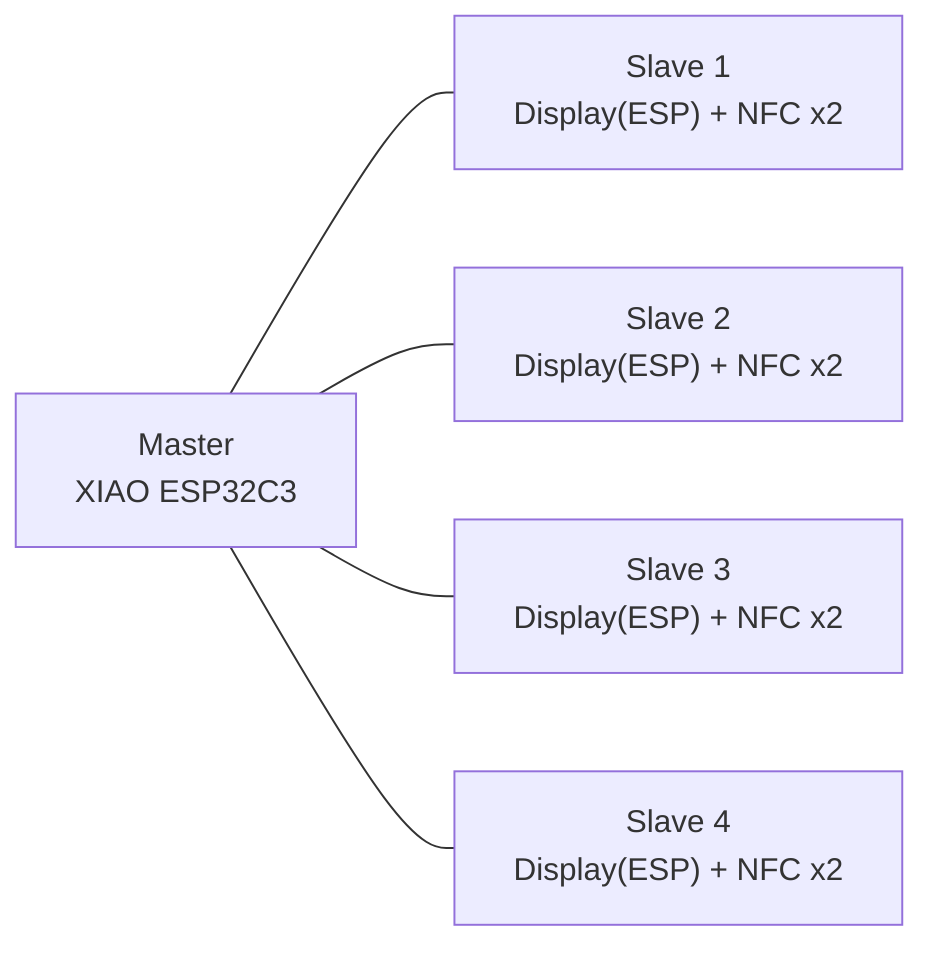
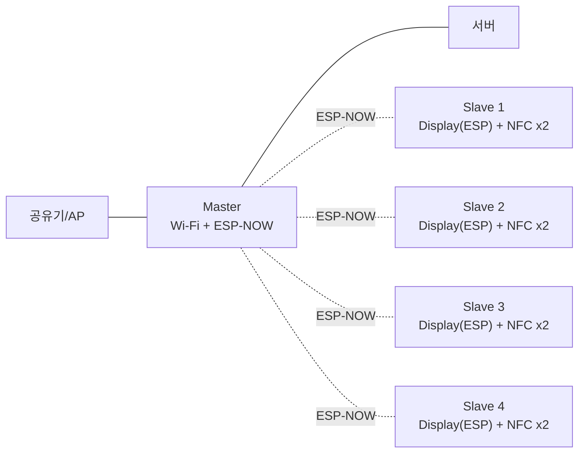

# 스마트 행거 ESP-NOW 전체 정리본 최종본

## 참고한 출처

### 공식 문서
- ESP-FAQ ESP-NOW  
  https://docs.espressif.com/projects/esp-faq/en/latest/application-solution/esp-now.html
- ESP-IDF ESP-NOW  
  https://docs.espressif.com/projects/esp-idf/en/stable/esp32/api-reference/network/esp_now.html
- Arduino ESP32 ESP-NOW  
  https://docs.espressif.com/projects/arduino-esp32/en/latest/api/espnow.html
- ESP-IDF Wi-Fi  
  https://docs.espressif.com/projects/esp-idf/en/latest/esp32/api-reference/network/esp_wifi.html
- Arduino ESP32 Wi-Fi API  
  https://docs.espressif.com/projects/arduino-esp32/en/latest/api/wifi.html
- ESP-NOW SDK  
  https://docs.espressif.com/projects/esp-now/en/latest/

### 보조 참고
- Seeed XIAO ESP-NOW  
  https://wiki.seeedstudio.com/xiao_espnow/
- PlatformIO espressif32  
  https://docs.platformio.org/en/latest/platforms/espressif32.html
- PlatformIO espressif8266  
  https://docs.platformio.org/en/stable/platforms/espressif8266.html

---

## 최종 결론

우리 스마트 행거 구조에서는 **ESP-NOW 적용이 가능하다.**  
특히 현재 유선 기반의 Master-Slave 데이터 전달 부분을 **무선 ESP-NOW 링크로 대체**하는 방향이 가장 적절하다.

다만 중요한 점은 다음과 같다.

1. **ESP-NOW는 인터넷 통신이 아니라 ESP 간 로컬 무선 통신이다**
2. **Master가 일반 Wi-Fi(AP 연결)와 ESP-NOW를 동시에 사용하면, ESP-NOW 채널은 AP 채널과 같아야 한다**
3. **Slave가 일반 Wi-Fi를 안 써도, ESP-NOW를 쓰는 순간 채널은 반드시 Master와 같아야 한다**
4. **정상 운용 중 채널 정보를 공유하는 것만으로는 부족하고, 복구를 위한 Slave 측 채널 탐색 전략이 필요하다**
5. **운영 안정성을 위해서는 공유기 2.4GHz 채널 고정을 강하게 권장한다**

---

## 먼저 정정할 점: Slave 개수 해석

현재 디스플레이 버전 구조에서는  
**각 Display 보드 자체가 ESP Slave 노드**이다.

즉:

- Slave 1 = Display(ESP) + NFC 2개
- Slave 2 = Display(ESP) + NFC 2개
- Slave 3 = Display(ESP) + NFC 2개
- Slave 4 = Display(ESP) + NFC 2개

따라서 예를 들어 Display 보드가 4개라면:
- Slave ESP는 4개
- NFC 리더는 8개

즉 **NFC 개수만큼 ESP가 있는 것이 아니라, Display 보드 수만큼 Slave ESP가 있는 구조**로 이해해야 한다.

---

## 현재 스마트 행거 구조

현재 코드 기준 구조는 기본적으로 **I2C 기반 Master-Slave 테스트 시스템**이다.

흐름은 다음과 같다.

1. 각 Slave가 NFC를 읽음
2. Slave가 읽은 UID를 내부 큐에 저장
3. Master가 주기적으로 각 Slave를 polling
4. Slave는 저장된 데이터를 Master에 응답
5. Master는 수신 데이터를 다시 echo 형태로 Slave에 전달
6. Slave는 Display에 결과를 출력

즉 현재 구조의 핵심은:

- **Slave에서 데이터 생성**
- **Master가 주기적으로 수집**
- **Master가 결과를 다시 전달**
- **Slave는 표시/UI 담당**

---

## 현재 구조 시각화



이 구조에서 현재 `M --- Sx` 부분이 유선 I2C/버스 기반 통신에 해당한다.

---

## ESP-NOW 적용 후 구조

ESP-NOW를 적용하면, 현재 Master-Slave 사이의 데이터 통신 부분을 무선화할 수 있다.

적용 후 개념 구조는 다음과 같다.

- Slave는 NFC를 읽고 Master에 ESP-NOW로 전송
- Master는 데이터를 수집
- Master는 서버/앱과 일반 Wi-Fi로 통신 가능
- 필요하면 Master가 다시 Slave에 명령/응답/표시용 데이터 전달

즉 구조는 다음과 같이 바뀐다.



---

## 남는 선과 없어지는 선

ESP-NOW를 넣는다고 해서 모든 배선이 사라지는 것은 아니다.  
정확히는 **Master-Slave 간 데이터 배선이 줄어드는 것**이다.

### 없어지거나 크게 줄어드는 부분
- Master ↔ Slave 간 유선 데이터선
- 중앙 버스 기반 연결 구조
- I2C address 기반 통신 설계 부담

### 그대로 남는 부분
- 각 Slave 내부에서 Display(ESP) ↔ NFC 리더 연결
- 전원 공급선
- 각 보드 내부의 센서/디스플레이 배선

즉 ESP-NOW의 장점은  
**“전체 무선화”가 아니라 “노드 간 데이터 통신 무선화”**로 이해하는 것이 맞다.

---

## 어떤 칩에서 사용할 수 있는가

ESP-NOW는 별도 하드웨어 모듈이 아니라, **ESP 계열 칩의 Wi-Fi 라디오를 이용하는 Espressif 전용 connectionless protocol**이다.

공식 문서 기준 지원 계열:
- ESP8266
- ESP32
- ESP32-S
- ESP32-C

즉 우리가 쓰는 계열에서는 충분히 적용 범위 안에 들어간다.

---

## 어떻게 확인해야 하는가

ESP-NOW 적용 가능 여부는 아래 3가지를 기준으로 보면 된다.

1. **칩이 Espressif 계열인지**
2. **해당 SDK/프레임워크가 ESP-NOW API를 제공하는지**
3. **현재 프로젝트 빌드 환경에서 사용할 수 있는지**

확인 순서:
- 보드에 탑재된 칩셋 확인
- 칩 데이터시트 확인
- SDK 문서에서 ESP-NOW API 확인
- PlatformIO/Arduino/ESP-IDF 환경에서 예제 빌드 가능 여부 확인

---

## 우리 프로젝트 기준으로는 어디서 봐야 하는가

우리 프로젝트에서는 아래 관점으로 보면 된다.

### Master
- XIAO ESP32C3
- 일반 Wi-Fi + ESP-NOW 동시 사용 후보
- 서버 연결 + Slave 수집의 게이트웨이 역할

### Slave
- Display 보드에 올라간 ESP 계열 칩
- NFC 2개와 연결된 현장 노드
- ESP-NOW로 Master와 통신

즉 Master와 Slave 모두 ESP-NOW 가능 칩이면 구조상 문제 없다.

---

## ESP-NOW는 어떤 방식의 통신인가

ESP-NOW는 일반 TCP/IP 연결처럼 association를 만들고 소켓을 여는 방식이 아니라,  
**Wi-Fi vendor-specific action frame** 기반의 connectionless 통신이다.

즉 특징은:
- 빠름
- 가벼움
- 저전력에 유리
- 근거리 ESP 간 통신에 적합
- 인터넷으로 바로 가는 프로토콜은 아님

우리 프로젝트에서는 다음처럼 쓰는 것이 맞다.

- Slave ↔ Master: ESP-NOW
- Master ↔ 서버/AP: 일반 Wi-Fi

즉 Master는 **게이트웨이**가 된다.

---

## 속도는 어느 정도인가

공식 FAQ 기준:
- PHY rate 기본값은 **1 Mbps**
- 실효 전송률은 환경에 따라 달라짐
- 공개된 FAQ 예시 기준:
  - 열린 환경 약 214 Kbps
  - 차폐 환경 약 555 Kbps

스마트 행거는 NFC UID, 상태값, 표시 명령 등 **소량 데이터 중심**이므로 대역폭 자체는 큰 문제가 아닐 가능성이 높다.

---

## 2.4GHz 간섭 문제는 없는가

간섭 가능성은 있다.

특히:
- 같은 공간의 일반 Wi-Fi
- 블루투스
- 전자레인지 등 2.4GHz 주변 장비
- 금속 구조물
- 밀집 설치 환경

스마트 행거는 구조상 금속 프레임/밀집 배치 가능성이 있으므로 **현장 테스트가 매우 중요**하다.

---

## Wi-Fi와 ESP-NOW를 같이 쓰면 어떻게 되는가

우리 구조에서는 **Master만 Wi-Fi(AP 연결) + ESP-NOW를 동시에 사용**할 가능성이 높다.

공식 문서 기준 핵심 규칙은 다음이다.

> **Wi-Fi와 ESP-NOW를 동시에 사용할 때 ESP-NOW 채널은 연결된 AP 채널과 같아야 한다.**

즉:
- Master가 AP 채널 6에 연결되면
- Master의 ESP-NOW도 채널 6에서 동작해야 한다
- Slave들도 Master와 통신하려면 채널 6에 있어야 한다

여기서 중요한 점은:

**Slave가 일반 Wi-Fi를 안 써도 ESP-NOW 채널은 반드시 중요하다.**

즉:
- Master만 채널 문제를 가지는 것이 아니라
- Slave도 Master 채널을 따라가야 한다

---

## 현재 채널은 어떻게 알 수 있는가

Master는 AP에 연결되어 있으므로 현재 채널을 런타임에 읽을 수 있다.

예:
```cpp
uint8_t primary;
wifi_second_chan_t second;
esp_wifi_get_channel(&primary, &second);
// primary = 현재 채널
```

또는 연결 AP 정보를 읽는 방식도 가능하다.

```cpp
wifi_ap_record_t ap_info;
esp_wifi_sta_get_ap_info(&ap_info);
```

실무적으로는 `esp_wifi_get_channel()`이 가장 직접적이다.

---

## 단순 하드코딩만으로 충분한가

조건부로만 충분하다.

### 하드코딩이 가능한 경우
- 공유기 2.4GHz 채널이 고정
- 현장 AP 구성이 바뀌지 않음
- Master가 항상 같은 AP 채널에 붙음

이 경우:
- Master와 Slave 모두 채널 6 같은 고정값 사용 가능
- 구현이 단순
- 운영 안정성이 높음

### 하드코딩만으로 부족한 경우
- 공유기 채널이 Auto
- AP 재부팅/환경 변화로 채널이 바뀔 수 있음
- 같은 SSID를 가진 다른 AP로 재연결 가능성 있음

이 경우:
- Master는 새 채널로 옮겨감
- Slave는 이전 채널에 남을 수 있음
- 통신 단절 가능

즉 **운영 환경이 가변적이면 채널 복구 로직이 필요**하다.

---

## 정상 운용 중 채널 동기화 전략

가장 현실적인 방식은  
**정상 통신 중 Master가 자신의 채널을 Slave에게 주기적으로 알려주는 것**이다.

### Master 동작
- 현재 채널을 알고 있음
- heartbeat/status 패킷 전송
- payload 안에 `current_channel` 포함

예:
```cpp
struct MasterHeartbeat {
  uint8_t type;
  uint8_t channel;
  uint32_t seq;
};
```

### Slave 동작
- heartbeat 수신 시 `lastKnownChannel = heartbeat.channel`
- 필요 시 NVS/Preferences 저장
- `lastHeartbeatMs` 갱신

예:
```cpp
lastKnownChannel = heartbeat.channel;
saveToNvs(lastKnownChannel);
lastHeartbeatMs = millis();
```

이 구조는 정상 운용 중에는 매우 유효하다.

---

## 하지만 이것만으로는 부족한 이유

채널이 이미 어긋난 뒤에는, 그 heartbeat 자체를 받을 수 없다.

예:
- 원래 채널 6에서 정상 운용
- Master가 AP 재연결 후 채널 11로 변경
- Slave는 여전히 채널 6

이때:
- Master는 11에서 송신
- Slave는 6에서 대기
- heartbeat를 못 받음
- 따라서 “나 지금 몇 채널이야?”라고 물어보는 것도 불가능

즉 **채널 정보 공유는 정상 운용 시 보조 수단이고, 복구 수단은 아니다.**

---

## Slave 부팅 시 전략

Slave는 부팅 시 전체 채널을 무작정 탐색하기보다, **마지막으로 기억한 채널부터 먼저 시도**하는 것이 좋다.

권장 절차:
1. 저장된 `lastKnownChannel` 읽기
2. 그 채널로 맞춤
3. 일정 시간 Master heartbeat 대기
4. 수신 성공 시 `LOCKED`
5. 실패 시 `SEARCH`로 전환

즉:
- 1차: 마지막 채널 우선
- 2차: 후보 채널 탐색

이 방식은 재부팅 후 복구 시간을 줄인다.

---

## 채널이 바뀌었을 때의 복구 전략

채널이 바뀐 뒤 진짜 복구를 하려면  
Slave가 **채널 탐색(scan-like hopping)** 을 해야 한다.

예:
- 마지막 채널 재시도
- 실패 시 1 → 6 → 11
- 또는 1~13 전체 순환
- 각 채널에서 짧게 heartbeat 수신 대기
- 수신 성공 시 그 채널로 lock

이 방식이 ESP-NOW에서의 “기지국 찾기”에 가장 가까운 구현이다.

---

## Slave 상태머신 제안

### `LOCKED`
- 마지막으로 확인된 채널에서 정상 운용
- heartbeat 정상 수신 중
- `lastKnownChannel` 유지

### `SUSPECT_LOSS`
- heartbeat를 일정 시간 못 받음
- 일시적 전파 문제인지 채널 이동인지 확인 중

### `SEARCH`
- 저장된 마지막 채널 우선 시도
- 이후 후보 채널 순환 탐색
- heartbeat 수신 시 즉시 lock

### `RELOCKED`
- 새 채널 발견
- `lastKnownChannel` 갱신
- NVS 저장
- 정상 상태로 복귀

상태 전이:
```text
LOCKED
  ↓ heartbeat timeout
SUSPECT_LOSS
  ↓ 유예 시간 내 미복구
SEARCH
  ↓ heartbeat 발견
RELOCKED
  ↓
LOCKED
```

---

## 채널 탐색 전략 제안

### 간단 버전
- 마지막 채널
- 1
- 6
- 11

장점:
- 빠름
- 구현 단순

단점:
- 예외 채널 대응 한계

### 확장 버전
- 마지막 채널 우선
- 이후 1~13 전체 탐색

장점:
- 복구 범위 넓음

단점:
- 탐색 시간 증가

스마트 행거는 설치형 제품이므로 우선은  
**“마지막 채널 우선 + 1/6/11 탐색”**이 가장 현실적이다.

---

## 추천 heartbeat payload

```cpp
struct MasterHeartbeat {
  uint8_t type;        // HEARTBEAT
  uint8_t channel;     // 현재 Master 채널
  uint32_t seq;        // sequence
  uint32_t uptimeSec;  // optional
};
```

활용 목적:
- `channel`: 채널 동기화
- `seq`: 패킷 누락/지연 감지
- `uptimeSec`: Master 재부팅 추정

---

## 추천 타이밍 정책 예시

예시값:
- heartbeat 주기: `500ms ~ 1000ms`
- `SUSPECT_LOSS` 진입: 2~3회 heartbeat 미수신
- `SEARCH` 진입: 3~5초 미수신
- 채널별 대기: 200~500ms

이 값은 현장 RF 환경에 맞춰 조정이 필요하다.

---

## 슬레이브가 많을 때 충돌은 어떻게 처리해야 하나

Slave가 많아질수록 동시에 송신하는 경우 충돌 가능성이 생긴다.  
ESP-NOW 자체는 가볍고 빠르지만, 애플리케이션 레벨에서 질서를 잡아주는 것이 좋다.

권장 방식:
- 이벤트 기반 송신
- 송신 후 ACK 확인
- 랜덤 지터 추가
- sequence 번호 사용
- 필요시 Master polling 또는 slotting 도입

즉 무조건 브로드캐스트처럼 다 같이 보내는 구조보다,  
**간단한 앱 레벨 제어를 추가한 ESP-NOW 링크 계층**으로 쓰는 것이 좋다.

---

## 스마트 행거용 추천 송신 정책

### Slave → Master
- NFC 태그 읽힘 이벤트 발생 시 전송
- 중복 UID 방지
- ACK 없으면 제한 횟수 재전송
- 필요 시 짧은 랜덤 지터 추가

### Master → Slave
- heartbeat/status는 주기 송신
- 표시 명령, 상태 변경, 설정 변경은 필요 시 송신
- Slave가 화면 표시용 ACK를 줄 수도 있음

즉:
- Master는 기준 채널/상태를 배포
- Slave는 이벤트 발생 시 보고

---

## 전력과 배터리는 어떻게 말해야 하나

ESP-NOW는 일반 Wi-Fi association 기반 통신보다 가볍기 때문에  
배터리 장치에서 장점이 있는 경우가 많다.

하지만 우리 스마트 행거는 전원 구조와 디스플레이/NFC 구성이 중요하므로,  
단순히 “ESP-NOW라서 무조건 저전력”이라고 말하면 안 된다.

정확한 표현:
- ESP-NOW는 프로토콜 측면에서 가볍고 저전력 운용에 유리할 수 있음
- 그러나 실제 전력은 디스플레이, NFC polling, 송신 주기, 슬립 전략에 따라 달라짐
- 따라서 전력 이득은 시스템 전체 설계와 함께 봐야 함

---

## 거리(range)는 어떻게 말해야 하나

거리도 단일 숫자로 단정하면 안 된다.

영향 요소:
- 설치 구조
- 금속 프레임
- 안테나 배치
- 간섭원
- 실내/실외
- 노드 방향
- 전원 노이즈

스마트 행거는 금속 구조 가능성이 높으므로  
**거리보다도 현장 배치에서 안정적으로 heartbeat/이벤트가 유지되는지**가 더 중요하다.

즉 범용적으로는:
- “ESP-NOW는 근거리 로컬 장치 간 통신에 적합”
- “정확한 통신 품질은 현장 RF 테스트 필요”

라고 정리하는 것이 맞다.

---

## 무엇이 좋아지고, 무엇이 문제인가

### 좋아지는 점
- Master-Slave 유선 데이터 배선 감소
- 설치 자유도 향상
- 중앙 버스 길이 제약 감소
- 구조 확장성 향상
- 노드 독립성 증가

### 새로 생기는 문제
- RF 간섭 고려 필요
- 채널 동기화 필요
- Slave 채널 복구 필요
- 패킷 누락 대비 ACK/재전송 필요
- 현장 RF 테스트 필요

즉 유선의 복잡함이 줄어드는 대신, 무선 운영 논리가 필요해진다.

---

## 바뀌어야 할 점: HW

### 현재
- Master ↔ Slave 데이터선 존재
- I2C address 기반 버스 구조
- Slave 내부에 Display와 NFC 연결

### 변경 후
- Master ↔ Slave 데이터선 제거 또는 대폭 축소
- 각 Slave는 독립 무선 노드
- 전원선은 대부분 그대로 유지
- Slave 내부 Display ↔ NFC 연결은 유지

즉 HW 변화의 본질은  
**노드 간 데이터 버스 제거**이다.

---

## 바뀌어야 할 점: SW

### 현재 Master 측
- Slave address 목록 관리
- 주기 polling
- 수신 데이터 파싱
- echo 전송

### ESP-NOW 적용 후 Master 측
- Wi-Fi 초기화
- AP 연결
- 현재 채널 확인
- ESP-NOW 초기화
- peer 등록 또는 동적 peer 관리
- receive callback 처리
- heartbeat/status 송신
- 필요 시 ACK/재전송/명령 송신

### 현재 Slave 측
- NFC 읽기
- I2C 응답 큐
- Master polling 대기
- echo 수신

### ESP-NOW 적용 후 Slave 측
- ESP-NOW 초기화
- 마지막 채널 복원
- heartbeat 수신
- `lastKnownChannel` 저장
- timeout 시 `SEARCH` 모드
- NFC 이벤트 시 Master 송신
- ACK 실패 시 재시도

---

## 유지 가능한 것과 새로 필요한 것

### 유지 가능한 것
- NFC 읽기 로직
- Display 표시 로직
- UID 가공 로직
- Logger/TaskRunner/상태 관리 구조
- 중복 태그 처리 로직

### 새로 필요한 것
- ESP-NOW link layer
- peer MAC 관리
- packet type 정의
- ACK/재전송 정책
- sequence 번호
- Master heartbeat
- Slave 채널 동기화
- Slave 채널 탐색 상태머신
- NVS 채널 저장

---

## 코드 구조 관점에서 바뀌는 포인트

### Master 쪽에서 바뀌는 포인트
- 기존 `I2CMaster` 기반 slave polling 로직은 제거 또는 축소
- slave address 목록 대신 slave MAC 관리가 필요
- `Wire.requestFrom()` 기반 수집 대신 ESP-NOW receive callback 기반 수집으로 변경
- 주기 polling 대신 heartbeat 송신 + 이벤트 처리 구조로 이동

예시 개념:
```cpp
void onEspNowRecv(const uint8_t* mac, const uint8_t* data, int len) {
  // Slave 이벤트 수신
}

void sendHeartbeat() {
  MasterHeartbeat hb {
    .type = HEARTBEAT,
    .channel = currentChannel,
    .seq = heartbeatSeq++,
  };
  // broadcast or known peer send
}
```

### Slave 쪽에서 바뀌는 포인트
- 기존 `i2cSlave.send()` 구조는 `esp_now_send()` 기반으로 바뀜
- `Wire.onRequest`, `Wire.onReceive` 중심 구조는 필요 없어짐
- 대신 receive callback, ACK, retry, channel relock 상태 관리가 추가됨

예시 개념:
```cpp
void onNfcRead(const String& uid) {
  // packet 구성 후 master로 esp_now_send()
}

void onHeartbeat(const MasterHeartbeat& hb) {
  lastKnownChannel = hb.channel;
  lastHeartbeatMs = millis();
  saveChannelIfNeeded(lastKnownChannel);
}
```

---

## 최종 추천 구조

우리 스마트 행거에는 아래 구조를 추천한다.

1. **Master는 AP에 연결된다**
2. **Master는 현재 AP 채널을 런타임에 읽는다**
3. **Master는 heartbeat/status에 현재 채널을 포함해 Slave에 주기적으로 전송한다**
4. **Slave는 마지막으로 확인한 채널을 저장한다**
5. **Slave는 부팅 시 마지막 채널부터 먼저 시도한다**
6. **heartbeat timeout 시 Slave는 채널 탐색 모드로 전환한다**
7. **새 채널을 찾으면 저장하고 정상 운용으로 복귀한다**
8. **가능하면 공유기 2.4GHz 채널은 고정한다**

이 조합이 구현 난이도와 안정성의 균형이 가장 좋다.

---

## 사수에게 바로 말할 수 있는 최종 멘트

> 현재 스마트 행거의 Master-Slave 데이터 통신은 ESP-NOW로 무선화할 수 있습니다. Master는 일반 Wi-Fi와 ESP-NOW를 동시에 사용하면서 게이트웨이 역할을 하고, Slave는 ESP-NOW만 사용해도 됩니다. 다만 ESP-NOW는 같은 채널에서만 통신되므로, Master가 AP에 붙은 채널을 기준으로 Slave가 그 채널을 따라가야 합니다. 정상 운용 중에는 Master heartbeat에 현재 채널을 실어 보내고 Slave가 이를 저장하도록 하며, 통신이 끊겼을 때는 Slave가 마지막 채널 우선 재시도 후 채널 탐색으로 복구하는 구조가 필요합니다. 운영 안정성을 위해서는 공유기 2.4GHz 채널을 고정하는 것이 가장 좋습니다.

---

## 아주 짧은 핵심 요약

- ESP-NOW 적용 가능
- Master는 Wi-Fi + ESP-NOW 게이트웨이
- Slave도 ESP-NOW 채널은 Master와 같아야 함
- 정상 운용 중 채널 정보 공유 필요
- 채널 어긋남 복구를 위해 Slave 탐색 필요
- 가장 좋은 운영 방식은 **공유기 채널 고정 + Slave 복구 로직 보유**
